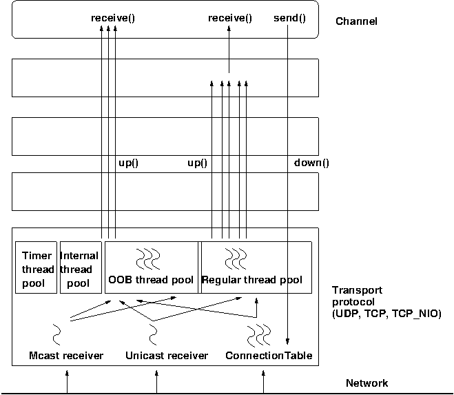
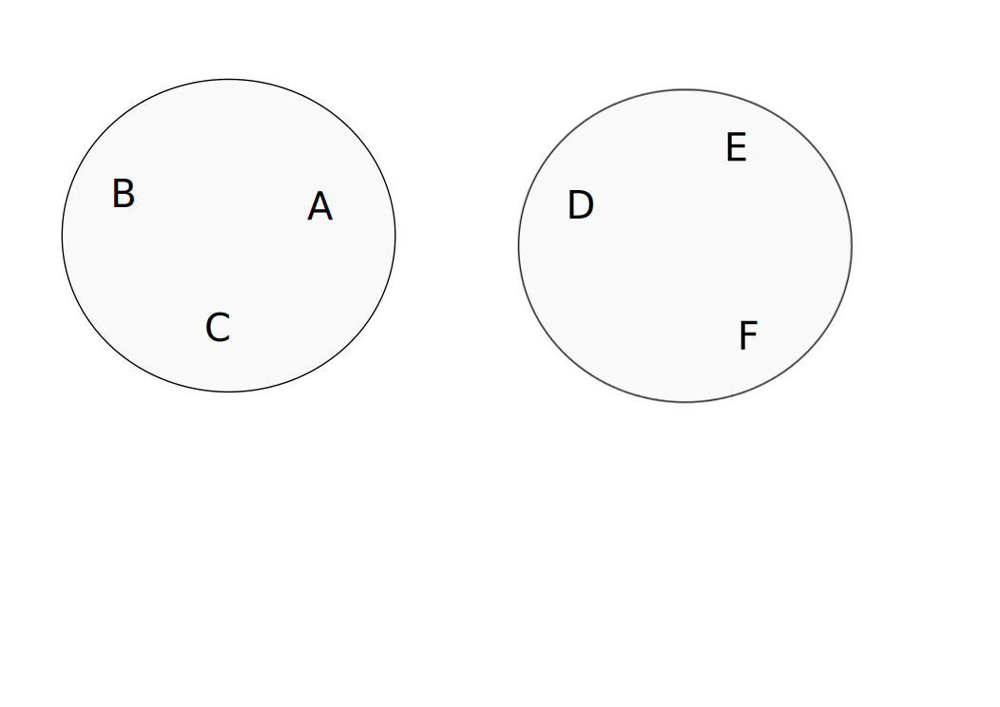

Advanced topics
===============
author: Bela Ban belaban@yahoo.com

Message flags
-------------
* Message flags are used to override default behavior provided by the protocols in a stack
* Examples:
** Mark a message as OOB (out-of-band) to deliver multiple messages from the same sender concurrently
** Skip the flow control protocols
* The advantage of tagging messages is that we don't need to change the configuration, but instead
  can override it on a per-message basis.

* API:

[source,java]
----
public Message setFlag(Flag ... flags);
----

* Example:

[source,java]
----
Message msg=new Message(null, "hello").setFlag(Message.Flag.OOB).name("A");
----

Provided message flags
----------------------
Message.OOB:: Marks a message as _out-of-band_. OOB messages don't not provide any ordering guarantees,
              although they're are reliable (no loss) and are delivered only once.

Message.DONT_BUNDLE:: Causes the transport not to bundle the message, but to send it immediately.

Message.NO_FC:: Bypasses any flow control protocols.

Message.NO_RELIABILITY:: Bypasses reliable protocols; makes the message unreliable. An unreliable message has no
                         ordering constraints, may get dropped or delivered multiple times.

Message.NO_TOTAL_ORDER:: If we use a total order configuration with `SEQUENCER`, then we
                         can bypass `SEQUENCER` (if we don't need total order for a given message) by tagging the message
                         with `NO_TOTAL_ORDER`.

Message.RSVP:: When this flag is set, a message send will block until the receiver (unicast) or receivers
               (multicast) have acked reception of the message, or until a timeout occurs.

Message.DONT_LOOPBACK:: When set, a message is multicast, but not looped back up the stack.
                        Useful when a sender doesn't want to receive its own multicast. +
                        Note that this is a _transient flag_, so `Message.isTransientFlagSet()` has
                        to be used instead of `Message.isFlagSet()`

OOB messages
------------
* Regular messages are ordered as follows
** Messages from the same sender are delivered FIFO: one-by-one
** Messages from different senders are delivered in parallel
*** When P sends P1 -> P2 -> P3, P1 is delivered first, then P2, then P3
*** P3 has to wait until both P1 and P2 have been processed
* However, _OOB messages_ completely ignore any ordering constraints the stack might have
** A message marked as OOB is processed by the OOB thread pool, not the regular thread pool (see below)
** When P sends P1 -> P2 -> P3, then all 3 messages are delivered randomly (but only once !)
*** Whether all 3 messages are really delivered in parallel also depends on the config of the OOB thread pool

The transport
-------------
* Bottom most protocol in the stack
* Serializes messages and sends them as UDP datagram packets, or sends them over a TCP connection
* Receives packets and de-serializes them into messages, which are then passed up the stack
* 4 thread pools for handling of incoming messages
. Regular thread pool
. OOB thread pool
. Internal thread pool
. Timer thread pool
* All thread pools can be configured (e.g. min/max threads)
* The thread pools can be replaced with custom thread pools
* The thread factories can also be replaced
* The transport also manages all sockets (UDP or TCP)

Available transports
--------------------
* Currently `UDP` and `TCP`
* UDP uses _IP multicasting_
** A message to N cluster nodes is sent *once*, as a datagram packet to a multicast (class D) address
*** Class D addresses: `224.0.0.1` - `239.255.255.255` (`224.0.0.x` reserved for host / router pings)
** The switch copies the packet to all ports which have multicast group members
** This can be turned off by setting `ip_mcast` to `false` in `UDP`
* TCP uses N-1 TCP connections; 1 connection per destination
** A message to N cluster nodes is sent *N-1 times*
*** This generates a lot of traffic
*** 1 thread per connection
* Recommendation: don't use TCP for large clusters, or clusters with a lot of traffic
** But: I've run a 1000 node TCP cluster on Google Compute Engine... :-)
*** http://belaban.blogspot.ch/2014/07/running-jgroups-cluster-in-google.html

The transport
-------------

* UDP: 1 receiver thread for unicast datagram packets, 1 thread for multicast packets
* TCP: 1 thread per connection model; ie. in a 100 node cluster, we have 99 connection receiver threads in a node
** In 4.0, NIO.2 will be used to manage all TCP connections with a configurable pool of threads
* A receiver thread receives a network packet and - depending on the type - passes it to the right thread pool
** The pool performs
*** Version checking (drops packets with different version)
*** Deserializes the buffer into a `Message`
*** Passes the message (or message batch) up through the protocol stack all the way to the channel

Thread pools
------------
Regular:: Handles regular messages (non-OOB, non-internal)

OOB:: Handles OOB messages

Internal:: Handles `INTERNAL` messages. Reserved for use by JGroups. Needed to deliver some important messages by
           JGroups protocols (e.g. heartbeats in failure detection), without potentially blocking on user messages.

Timer:: Used to execute tasks (periodic or one-time), e.g. retransmission, expiry of connection pools, stability etc

Configuration of thread pools
-----------------------------
* All pools need to implement `java.util.concurrent.Executor` and the default implementations use
  `java.util.concurrent.ThreadPoolExecutor`
* The configuration of a thread pool is done with properties of the form <pool_name>.<attr>,
  e.g. `oob_thread_pool.min_threads`. The pool names are `thread_pool` (regular), `oob_thread_pool`, `internal` and
  `timer`
* The following attributes are used:

[width="90%",cols="2,10", frame="topbot",options="header"]
|====
| Name | Function
|enabled | If false, the thread pool is not enabled: when a message is received, it is passed up the stack by the receiver thread
| min_threads | The min number of threads
| max_threads | The max number of threads
| keep_alive_time | Time (ms) after which an idle thread should be returned to the pool
| queue_enabled | Whether or not a thread pool should have a queue enabled
| queue_max_size | The max size of a queue (if enabled)
| rejection_policy | The rejection policy. One of `run`, `discard`, `discardoldest` or `abort`
|====

Thread pool behavior
--------------------
* Semantics are the same as for `ThreadPoolExecutor`: on submission of a task:
* If we have fewer than `min_threads` -> create an additional thread
* Else:
** If a queue is enabled and not full -> queue the task
** Else create an additional thread if we're below `max_threads`
* If the queue is full (or disabled) or we've reached `max_threads` and all threads are busy -> consult the rejection policy

run:: Pass the message up on the receiver's thread. If there's a risk that the thread might block, or take a long time,
      this hampers the ability of the receiver to quickly remove packets and might thus lead to queue overflow
      (or a 0 TCP write window, _blocking the sender_)
discard:: Discard the message. JGroups retransmission will later retransmit the message, but dropping a message is
          good as it tells the sender to slow down a bit (via the flow control protocols)
abort:: same as discard, but throw an exception
discardoldest:: Discards the oldest message first

Thread pool use
---------------
* An OOB message uses 1 thread which passes it all the way up to the channel and to the application (see Transport)
** If the application sends another message (or invokes an RPC) _on the same thread_, that incoming thread can be
   busy for quite a while
* A regular message is passed up to the reliable protocol (either NAKACK for mcasts or UNICAST for unicasts)
** The message is then added to a table
** If there's no other thread busy removing messages from the table -> Set a CAS and
   remove as many messages as possible and pass them up
** Else return (thread is ready to process other messages)
** Most threads will only add their message (or message batch) to the table and return

Recommended configs
-------------------

[width="90%",cols="2,10",frame="topbot",options="header"]
|====
| Pool | Recommendation
| OOB | No queue -> OOB messages are executed on a thread or dropped. +
Set `min_size` to the number of cluster nodes, `max_size` should be higher than the max number of OOB messages received
at any given time
|Regular| Queue is enabled and quite large, to handle message peaks. +
Set `min_size` to the number of cluster nodes plus a few more (D), `max_size` to a slightly higher value. +
In a cluster of N, we never have more than N threads passing messages up, so we need D additional threads to
handle all other regular messages and add them to the retransmission tables. This is quick so D can be small.
|Internal| Leave the default config (min=2,max=4), don't touch
| Timer | Defaults (min=2,max=4,small queue) should be sufficient
|====

Message batching
----------------
* For historic reasons, message _bundling_ is used on the sender, _batching_ on the receiver
** Let's use the term _batching_ only
* When sending many smaller messages, it is better to queue them and send them as a _message batch_
** Payload / header ratio is better (e.g. payload of 5, header of 30 !)
* Simple sender algorithm:
----
LOOP(while there are messages pending for destination D):
    - If the message batch size for D is < max bundle size: add the message to the batch
    - Else: send the batch, create a new batch for D and add the message
ENDLOOP
- Send batch if size > 0
----
* This collects many messages into a batch until the `max_bundle_size` has been reached, but sends individual messages
  immediately
* E.g. message P1-5 are sent at time T1, and P6 at time T20: this create a batch for P1-5 and a single message for P6
* Message batching can be overridden with flag `DONT_BUNDLE`

Message batching on the receiver
--------------------------------
* On the receiver, we create instances of `MessageBatch` for batches (one for each destination) and pass the batches
  up rather than the individual messages
* Advantages:
** Multiple messages can be processed in one go
** Locks are acquired once for a batch (say of 10) rather than 10 times -> less context switching
** `NAKACK` / `UNICAST`: add N messages into the retransmission table *in one step* rather than *N steps*
** The destination and sender addresses are sent *only once rather than N times*

Sending messages synchronously (RSVP)
-------------------------------------
* While JGroups guarantees that a message will eventually be delivered at all non-faulty members,
  sometimes this might take a while
** We don't know when a message has been delivered at all nodes
* This can be changed by setting flag `Message.RSVP` in a message
** The send blocks until all members have acknowledged reception (or delivery) of the message
   (excluding members which crashed or left meanwhile).
* If we send an `RSVP` tagged message, then - when `send()` returns - we're guaranteed that all messages
  sent _before_ will have been delivered at all members as well
** If P sends messages 1-10, and marks 10 as `RSVP`, then, upon `JChannel.send()` returning,
   P knows that all members received messages 1-10 from P.

NOTE: Since RSVP'ing a message is costly, and might block the sender for a while, it should be
used sparingly. For example, when completing a unit of work (ie. member P sending N messages), and
P needs to know that all messages were received by everyone, before sending other messages.

Configuration and use
---------------------
* To use RSVP, 2 things have to be done:
* First, the `RSVP` protocol has to be in the config, somewhere above the reliable transmission
  protocols such as `NAKACK` or `UNICAST(2)`, e.g.:

[source,xml]
----
<config>
    <UDP/>
    <pbcast.NAKACK2 />
    <UNICAST3 />
    ...
    <RSVP />
</config>
----

* Secondly, the message we want to get ack'ed must be marked as `RSVP`:

[source,java]
----
Message msg=new Message(null, "hello world").setFlag(Message.RSVP);
ch.send(msg);
----

* Method `send()` returns as soon as it has received acks from all current members
** If there are 4 members A, B, C and D, and A has received acks from itself, B and C,
   but D's ack is missing and D crashes before the timeout kicks in, then this will
   nevertheless make `send()` return, as if D had actually sent an ack.
* If the `timeout` property is greater than 0, and we don't receive all acks within
  `timeout` milliseconds, a `TimeoutException` will be thrown (if `RSVP.throw_exception_on_timeout` is true)
** The application can choose to catch this (runtime) exception and do something with it, e.g. retry.

Non blocking RSVP
-----------------
* Sometimes a sender wants a given message to be resent until it has been received, or a timeout occurs, but doesn't
  want to block. As an example, `RpcDispatcher.callRemoteMethodsWithFuture()` needs to return immediately, even
  if the results aren't available yet.
** If the call options contain flag `RSVP`, then the future would only be returned once all responses have been
   received. This is clearly undesirable behavior.
* To solve this, flag `RSVP_NB` (non-blocking) can be used. This has the same behavior as `RSVP`, but the caller is not
  blocked by the RSVP protocol. When a timeout occurs, a warning message will be logged, but since the caller doesn't
  block, the call won't throw an exception.

Generating custom addresses
---------------------------
* Address generation is pluggable: an application can define what kind of
  addresses it uses. The default address type is `UUID`, and since some protocols use UUID, it is
  recommended to provide custom classes as _subclasses of UUID_.
* This can be used to pass additional data around with an address, for example information
  about the location of the node to which the address is assigned
* To use custom addresses, an implementation of `org.jgroups.stack.AddressGenerator`
  has to be written:

[source,java]
----
public interface AddressGenerator {
    Address generateAddress();
}
----

* For any class `CustomAddress`, it will need to get registered with `ClassConfigurator` in
  order to marshal it correctly:

[source,java]
----
class CustomAddress extends UUID {
    static {
        ClassConfigurator.add((short)8900, CustomAddress.class);
    }
}
----

NOTE: The ID should be chosen such that it doesn't collide with any IDs defined in
      `jg-magic-map.xml`.

* Set the address generator in `JChannel: setAddressGenerator(AddressGenerator)`. This has to
  be done _before_ the channel is connected.

Controlling view generation
---------------------------
* View generation is pluggable; application code can be called to determine how a new view is created
* The first member of a view is always the _coordinator_
** The application can therefore pick the coordinator
** Useful to
*** Pin the coordinatorship to only certain 'beefy' servers
*** Make sure that only one of the previous coordinators becomes the new coordinator after a merge. This
    reduces the frequency at which the coordinator moves around and thus increases stability for
    singleton services (services which are started only on one node in a given cluster).

* To do this, interface +MembershipChangePolicy+ has to be implemented

[source,java]
----
public interface MembershipChangePolicy {
    List<Address> getNewMembership(Collection<Address> current_members,
                                   Collection<Address> joiners,
                                   Collection<Address> leavers,
                                   Collection<Address> suspects);
    List<Address> getNewMembership(Collection<Collection<Address>> subviews);
}
----

* The first method is called to create a regular view: `current_members` is a list of the current members, `joiners`
  of new members, `leavers` of members which want to leave and `suspects` of members which have crashed
* The second method accepts a list of membership lists; each list is a subview that needs to get
  merged into a new `MergeView`

Generating a MergeView
----------------------
* For example, we could have +{A,B,C}+, +{M,N,O,P}+ and +{X,Y,Z}+:
* A, M and X are the respective coordinators of the subviews and the task of the code
  is to determine the _single coordinator_ of the merged view.
* The default implementation
** adds all subview coordinators to a sorted set,
** takes the first (say M), adds it to the resulting list and then
** adds the subviews in turn.
* This could result in a MergeView like +{M,A,B,C,N,O,P,X,Y,Z}+.

.Ordering and duplicate elements
NOTE: In both regular and merge views, it is important that there are no duplicate members. It is
      possible to get overlapping subviews in the case of a merge, for instance:
      +{A,B,C}+, +{C,D}+ and +{C,D}+. This _cannot_
      result in C or D being present in the resulting merge view multiple times.

* A +MembershipChangePolicy+ can be set in `GMS` via property `membership_change_policy`,
  which accepts the fully qualified classname of the implementation of `MembershipChangePolicy`.
** There is also a setter +setMembershipChangePolicy()+ which can be used to set the change policy programmatically

Sample view generation
----------------------
* The following example shows how to pin coordinatorship to a certain subset of nodes in a cluster.
* Beefy nodes need to be marked as such, and this is done by using a special address, generated by an
  `AddressGenerator`:

[source,java]
----
if(beefy)
    channel.setAddressGenerator(new AddressGenerator() {
        public Address generateAddress() {
            return ExtendedUUID.randomUUID(channel.getName());
        }
    });
}
----

* First we check if the node that's started needs to be marked as beefy. If so, we grab the current channel
  and set an `AddressGenerator` which creates an `ExtendedUUID`.
* The +MembershipChangePolicy+ now knows if a node is beefy by checking if the node's
  address is an `ExtendedUUID`.

A sample MembershipChangePolicy
-------------------------------

[source,java]
----
public List<Address> getNewMembership(Collection<Address> current_members,
                                      Collection<Address> joiners,
                                      Collection<Address> leavers,
                                      Collection<Address> suspects) {
    Membership retval=new Membership();
    for(Address addr: current_members)
        if(addr instanceof ExtendedUUID)
            retval.add(addr);
    for(Address addr: joiners)
        if(addr instanceof ExtendedUUID)
            retval.add(addr);
    retval.add(current_members).add(joiners);
    retval.remove(leavers).remove(suspects);
    return retval.getMembers();
}
----

* Beefy servers are at the head of a view. When a new beefy server joins, it should _not_ become the new
  coordinator if the current coordinator already _is_ a beefy server, but add itself to the end of the beefy
  servers, ahead of non-beefy servers.
* First we create a +Membership+, which is an ordered list without duplicates. Then we iterate through
  the current membership and add the beefy servers to the list, followed by the beefy joiners.
* After that, we add all other current members and joiners and remove suspected and leaving members.
* Effect: while there are beefy servers in a view, the oldest beefy server will be the coordinator,
  then the second-oldest and so on.
** When no beefy servers are available, the oldest non-beefy server will be coordinator.
** When a beefy server joins again, it will become coordinator, taking the coordinatorship away from the
   previous non-beefy server.

Asynchronous invocation API
---------------------------
* A method invoked in an RpcDispatcher is dispatched to application code
  by calling method handle from `RequestHandler`:

[source,java]
----
public interface RequestHandler {
    Object handle(Message msg) throws Exception;
}
----

* In the case of RpcDispatcher, the `handle()` method converts the message's contents into a method call,
  invokes the method against the target object and returns the result (or throws an exception). The return value
  is then sent back to the sender of the message.
        
* The invocation is _synchronous_, ie. done on the thread responsible for dispatching this
  particular message from the network up the stack all the way into the application. The thread is therefore
  _busy_ for the duration of the method invocation.
        
* If the invocation takes a while, e.g. because locks are acquired or the application waits on some I/O,
  another thread will be used for a different request. This can quickly lead to the thread pool being
  exhausted or many messages getting queued if the pool has an associated queue.
        
* Therefore a new way of dispatching messages to the application was devised; the asynchronous invocation API
* A new interface `AsyncRequestHandler` (derived from `RequestHandler`) is introduced

AsyncRequestHandler
-------------------

[source,java]
----
public interface AsyncRequestHandler extends RequestHandler {
    void handle(Message request, Response response) throws Exception;
}
----

* `AsyncRequestHandler` adds an additional method taking a request message and a `Response` object.
* The request message contains the same information as before (e.g. a method call plus args)
* `Response` is used to send a reply at a later time, when processing is done.
        
[source,java]
----
public interface Response {
    void send(Object reply, boolean is_exception);
}    
----

* `Response` has information about the request (e.g. request ID and sender), and has method `reply()` to
  send a response. The `is_exception` parameter should be true if the reply is an exception, e.g.
  was thrown when `handle()` ran application code.
        
* The advantage of the new API is that it can be used asynchronously. The default
  implementation uses a synchronous invocation:

[source,java]
----
public void handle(Message request, Response response) throws Exception {
    Object retval=handle(request);
    if(response != null)
        response.send(retval, false);
}
----

* Method `handle()` synchronously calls into application code and returns a result, which is
  sent back to the sender of the request.

Use of the asynchronous invocation API
---------------------------------------
* An application can subclass `RpcDispatcher`, or it can set a custom request handler via
  `setRequestHandler()`, and implement `AsyncRequestHandler.handle()` by
  dispatching the processing to a thread from a thread pool.

* The thread which guided the request message from the network up to here will therefore immediately
  be released and can be used to process other messages.

* The response will be sent when the invocation of application code is done, and thus the thread from
  the thread pool is not blocked on I/O, or trying to acquire locks or anything else that blocks in
  application code.
        
* To set the mode which is used, method `RpcDispatcher.asyncDispatching(boolean)` can be used. This can be
  changed even at runtime, to switch between sync and async invocation style.

* Asynchrounous invocation is typically used in conjunction with an _application thread pool_. The application
  knows (JGroups doesn't) which requests can be processed in parallel and which ones can't.
** For example, all OOB calls could be dispatched directly to the thread pool, as ordering of OOB requests
   is not important, but regular requests should be added to a queue where they are processed sequentually.
        
* The main benefit here is that request dispatching (and ordering) is now under application control
  _if the application wants to do that_. If not, we can still use synchronous invocation.

* A good example where asynchronous invocation makes sense are replicated web sessions:
** If a cluster node A has 1000 web sessions, then replication of updates across the cluster generates messages from A.
** Because JGroups delivers messages from the _same_ sender _sequentially_, even
   updates to unrelated web sessions are delivered in strict order.
** With asynchronous invocation, the application could devise a dispatching strategy which assigns updates to
   different (unrelated) web sessions to any available thread from the pool, but queues updates to the same
   session, and processes those by the same thread, to provide ordering of updates to the same session.
*** This would speed up overall processing, as updates to a web session 1 on A don't have to wait until all
    updates to an unrelated web session 2 on A have been processed.

Fork channels
-------------
* A fork channel is a light-weight channel, forked off of a main channel (`JChannel`)
** Used as a private communication channel for a subsystem
** Additional protocols can be attached to a fork channel
** A fork channel only lives as long as the main channel lives
** Subclass of `JChannel`; but some methods are not supported (e.g. state transfer)
* Can be created declaratively (at main channel creation time) or dynamically using the programmatic API
* Use cases for fork channels:
** No need to configure a separate channel; use of an existing `JChannel` (e.g. grabbed
  from Infinispan or WildFly) for private communication
** If we cannot for some reason modify the main stack's configuration, we can create a fork channel and
   a corresponding fork stack and add the protocols we need to that fork stack. Example:
*** An application needs a fork stack with `COUNTER` (a distributed atomic counter) on top
*** To do so, it can create a fork stack with `COUNTER` and a fork channel connecting to that stack, and it will now
    have distributed atomic counter functionality on its fork stack, not available in the main stack

Architecture of fork channels
-----------------------------

image::../images/ForkArchitecture.png[Fork channels,width="60%"]

* In the example, a main channel and 5 fork channels (in the same JVM) are shown

* The brown stack to the left is the main stack and it has the main channel connected to it
** _The `FORK` protocol needs to be present in the main stack, or else fork stacks can not be created_
** It has 2 fork stacks: `"counter"` and `"lock"`

* The blue stack in the middle is a fork-stack with fork stack ID `"counter"`
** It adds protocol `COUNTER` to the protocols provided by the main stack
** Therefore a message passing down through fork stack `"counter"` will pass through protocols `COUNTER` -> `FORK` ->
   `MFC` -> `GMS`

Architecture of fork channels
-----------------------------
* Fork channels have an ID, e.g. `"fork-ch1"`
* The combination of fork stack ID and fork channel ID is used to demultiplex incoming messages
* If fork channel 2 sends a message, it'll pass through `COUNTER` and into `FORK`
** `FORK` adds a header to the message, containing `fork channel ID="fork-ch2"` and `fork stack ID="counter"`
** Then the message passes down the main stack, through `MFC`, `GMS` and so on
* When the message is received, it passes up the reverse order: `GMS` -> `MFC` -> `FORK`
** If there is no header, `FORK` passes the message up the main stack, where it passes through `FRAG2` and ends up
   in the main channel
** If a header is present, the fork stack ID is used to find the correct fork-stack (`"counter"`).
** The message then passes through `COUNTER`
** Finally, the fork channel ID (`"fork-ch2"`) is used to find the right fork channel and the message is passed to it
* Fork channels sharing the same fork stack also share state
** For example, fork channels `fork-ch1` and `fork-ch2` share `COUNTER`, which means they will see each other's
   increments and decrements of the same counter
** If fork stack `"lock"` also had a `COUNTER` protocol, and `fork-ch1` anf `fork-ch4` accessed a counter with
   the same name, they would still not see each other's changes, as they'd have 2 different `COUNTER` protocols.

FORK configuration
------------------

[source,xml]
----
<FORK config="/home/bela/fork-stacks.xml" />
----

* `FORK` refers to an external file to configure its fork stacks:

[source,xml]
----
<fork-stacks xmlns="fork-stacks">
    <fork-stack id="counter">
        <config>
            <COUNTER bypass_bundling="true"/>
        </config>
    </fork-stack>

    <fork-stack id="lock">
         <config>
             <CENTRAL_LOCK num_backups="2"/>
             <STATS/>
         </config>
    </fork-stack>

</fork-stacks>
----

* File `fork-stacks.xml` defines 2 fork stacks: `"counter"` and `"lock"`

* Element `<config>` is a regular JGroups configuration
** For example, fork stack `"lock"` creates a stack with 'CENTRAL_LOCK` and `STATS`

* When `FORK` is initialized, it will create the 2 fork stacks
* Fork channels can pick one of the 2 existing fork stacks to be created over,
  or they can dynamically create new fork stacks

Creation of fork channels
-------------------------
* A fork channel is created by instantiating a new `ForkChannel` object:

[source,java]
----
JChannel main_ch, fork_ch;                            // <1>
fork_ch=new ForkChannel(main_ch, "lock", "fork-ch4",  // <2>
                        new CENTRAL_LOCK(), new STATS());
fork_ch.connect("bla");                               // <3>
main_ch.connect("cluster");
----
<1> This is the main channel. Its stack may or may not contain `FORK`, but for this example, we
    assume it is present.
<2> The fork channel is created. It is passed the main channel, the fork stack ID (`"lock"`) and the
    fork channel ID (`"fork-ch4"`), plus a list of already created protocols (`CENTRAL_LOCK` and `STATS`). If
    `FORK` already contains a fork stack with ID=`"lock"`, the existing fork stack will be used, or else a new
    one will be created with protocols `CENTRAL_LOCK` and `STATS`. Then a new fork channel with ID=`"fork-ch4"` will
    be added to the top of fork stack `"lock"`. An exception will be thrown if a fork channel with the same ID
    already exists.
<3> The `ForkChannel` now calls `connect()`, but the cluster name is ignored as fork channels have the same
    cluster name as they main channel the reference. The local address, name, view and state are also the same.
    This means, that even though `connect()` was called, the fork channel is not yet connected. As soon as the
    main channel is connected, the fork channel will be connected, too.

* The lifetime of a fork channel is always dominated by the main channel: if the main channel is closed, all
  fork channels atttached to it are in closed state, too, and trying to send a message will throw an exception.

Dynamically inserting a FORK protocol
-------------------------------------
* The example above showed the simplified constructor, which requires the `FORK` protocol to be present in the
  stack. There's another constructor which allows for FORK to be created dynamically if not present:

[source,java]
----
public ForkChannel(final Channel main_channel,
                   String fork_stack_id, String fork_channel_id,
                   boolean create_fork_if_absent,
                   int position,
                   Class<? extends Protocol> neighbor,
                   Protocol ... protocols) throws Exception;
----

* In addition to passing the main channel, the fork stack and channel IDs and the list of protocols, this
  constructor also allows a user to create `FORK` in the main stack if not present. To do so,
  `create_fork_if_absent` has to be set to true (else an exception is thrown if `FORK` is not found), and the
  neighbor protocol (e.g. `FRAG2.class`) has to be defined, plus the position (`ProtocolStack.ABOVE/BELOW`)
  relative to the neighbor protocol has to be defined as well.

* The design of FORK / ForkChannel is discussed in more detail in
  link:$$https://github.com/belaban/JGroups/blob/master/doc/design/FORK.txt$$[https://github.com/belaban/JGroups/blob/master/doc/design/FORK.txt]

Relaying between multiple sites
-------------------------------
* A _site_ is a local cluster
* `RELAY2` relays unicast and multicast messages between different sites
* Each site is *completely autonomous* and knows nothing about different sites other than their names
* The coordinator of each site is the _site master_ and is responsible for traffic relaying
* Goals:
** Relay traffic between sites
** Send a unicast message to the _site master_ of a given site
** Send back a response to a sender from a different site

RELAY2 configuration
---------------------
* To use RELAY2, it has to be placed towards the top of the configuration, e.g.:

[source,xml]
----
...
<FRAG2 />
<relay.RELAY2 site="LON" config="/home/bela/relay2.xml"
              relay_multicasts="true" />
----

* The `site` property gives the local site its name, used for routing between sites
* Addresses contain site name, e.g. address `A1:LON` in the `SFO` site is not local, but will be routed
  to member `A` in the remote site `LON`.
* Property `relay_multicasts` determines whether or not multicast messages (with `dest` == `null`) are relayed to other sites
** When we have a site `LON`, connected to sites `SFO` and `NYC`, if a multicast message is sent in site `LON`,
   and `relay_multicasts` is true, then all members of sites `SFO` and `NYC` will receive the message

Sites configuration
-------------------
* The `config` property points to an XML file which defines the setup of the sites, e.g.:
[source,xml]
----
<RelayConfiguration xmlns="urn:jgroups:relay:1.0">
    <sites>
        <site name="lon">
            <bridges>
                <bridge config="/home/bela/global.xml" name="global"/>
            </bridges>
        </site>
        <site name="nyc">
            <bridges>
                <bridge config="/home/bela/global.xml" name="global"/>
            </bridges>
        </site>
        <site name="sfo">
            <bridges>
                <bridge config="/home/bela/global.xml" name="global"/>
            </bridges>
        </site>
    </sites>
</RelayConfiguration>
----
* This defines 3 sites `LON`, `SFO` and `NYC`, connected with a global cluster `"global"` (defined in `global.xml`)
* All _inter-site_ traffic is sent via this global cluster
* The above configuration is not prescribed, ie. instead of a global cluster, we could define separate clusters
  between `LON` and `SFO` and `LON` and `NYC`
** However, in such a setup, `NYC` and `SFO` wouldn't be able to send each other messages;
   only `LON` would be able to send message to `SFO` and `NYC`.

Relaying of multicasts
----------------------
* If `relay_multicasts` is true then any multicast received by the _site master_ of a site will relay the multicast
  to _all connected sites_
* A recipient of a multicast message which originated from a different site will see that the sender's
  address is not a `UUID`, but a subclass (`SiteUUID`) which is the `UUID` plus the site suffix, e.g. `A1:SFO`
* When a reply is to be sent to the originator of the multicast message, `Message.getSrc()` provides the target
  address for the unicast response message
** This is also a `SiteUUID`, but the sender of the response neither has to know nor take any special action to send
   the response, as JGroups takes care of routing the response back to the original sender.

Relaying of unicasts
--------------------
* Relaying of unicasts is done transparently
** However, if we don't have a target address (e.g. as a result of reception of a multicast), there is a special address
   `SiteMaster(name)` which identifies the site master; the coordinator of a local cluster
   responsible for relaying of messages.
* Class `SiteMaster` is created with the name of a site, e.g. `new SiteMaster("LON")`
** When a unicast with destination `SiteMaster("LON")` is sent, then we relay the message to the _current_
   site master of `LON`
** If the site master changes, messages will get relayed to a different node, which
   took over the role of the site master from the old (perhaps crashed) site master
* Sometimes only certain members of a site should become site masters; e.g. the more powerful boxes
  (as routing needs some additional CPU power), or multi-homed hosts which are connected to the external
  network (over which the sites are connected with each other).
** To do this, `RELAY2` can generate special addresses which contain the knowledge about whether a member
   should be skipped when selecting a site master from a view, or not
*** If `can_become_site_master` is set to false in `RELAY2`, then the selection process will skip that member
*** However, if all members in a given view are marked with `can_become_site_master`==`false`,
    then the first member of the view will get picked
* When we have all members in a view marked with `can_become_site_master`==`false`, e.g. `{B,C,D}`, then `B`
  is the site master
** If we now start a member `A` with `can_become_site_master`==`true`, then `B` will stop
   being the site master and `A` will become the new site master

Invoking RPCs across sites
--------------------------
* Invoking RPCs across sites is more or less transparent, except when we cannot contact a site
* If we want to invoke method `foo()` in `A1`, `A2` (local) and `SiteMaster("SFO")`, we could
  write the following code:

[source,java]
----
List<Address> dests=new ArrayList<>(view.getMembers());
dests.add(new SiteMaster("SFO"));
RspList<Object> rsps;
rsps=disp.callRemoteMethods(dests, call,
              new RequestOptions(ResponseMode.GET_ALL, 5000).setAnycasting(true));
for(Rsp rsp: rsps.values()) {
    if(rsp.wasUnreachable())
        System.out.println("<< unreachable: " + rsp.getSender());
    else
        System.out.println("<< " + rsp.getValue() + " from " + rsp.getSender());
}
----

* First, we add the members (`A1` and `A2`) of the current (local) view to the destination set
* Then we add the special address of the `SFO` site master: `SiteMaster("SFO")`
* Next, we invoke the call and block until responses from all `A1`, `A2` and `SiteMaster("SFO")`
  have been received, or until 5 seconds have elapsed.
* Finally, we check the response list
** If a site is unreachable, a `Rsp` has field `"unreachable"` set

Configuration
-------------
* Let's configure an example which consists of 3 sites `SFO`, `LON` and `NYC` and 2 members in each site
* First we define the configuration for the local cluster (site) `SFO`. To do this, we could for example copy `udp.xml`
  from the JGroups distro (and name it `sfo.xml`) and add `RELAY2` to the top
** `RELAY2`'s `config` property points to `relay2`.xml (as shown above)
** The `relay2.xml` file defines a global cluster with `global.xml`, which uses `TCP` and `MPING` for the
   global cluster (copy for example `tcp.xml` to create `global.xml`)
* Now copy `sfo.xml` to `lon.xml` and `nyc.xml`
* The `RELAY2` configuration stays the same for `lon.xml` and `nyc.xml`,
  but the multicast address and/or multicast port has to be changed in order to create 3 separate local
  clusters
** Therefore, modify both `lon.xml` and `nyc.xml` and change `mcast_port` and / or `mcast_addr` in `UDP`
   to use separate values, so the clusters don't interfere with each other.

Demo
----
* To test whether we have 3 different clusters, start the Draw application (shipped with JGroups):

....
java -Djava.net.preferIPv4Stack=true org.jgroups.demos.Draw -props ./sfo.xml -name sfo1
java -Djava.net.preferIPv4Stack=true org.jgroups.demos.Draw -props ./sfo.xml -name sfo2
java -Djava.net.preferIPv4Stack=true org.jgroups.demos.Draw -props ./lon.xml -name lon1
java -Djava.net.preferIPv4Stack=true org.jgroups.demos.Draw -props ./lon.xml -name lon2
java -Djava.net.preferIPv4Stack=true org.jgroups.demos.Draw -props ./nyc.xml -name nyc1
java -Djava.net.preferIPv4Stack=true org.jgroups.demos.Draw -props ./nyc.xml -name nyc2
....

* We should now have 3 local clusters (= sites) of 2 instances each
* If `RELAY2.relay_multicasts` is true, when you draw in one instance, we should see the drawing in all 6 instances
* This means that relaying of multicasting between sites works
** If this doesn't work, run a few Draw instances on `global.xml`, to see if they find each other
* Note that the first member of each cluster always joins the global cluster (defined by `global.xml`) too
** This is necessary to relay messages between sites

Testing unicasts between sites
------------------------------
* To test unicasts between sites, you can use the `org.jgroups.demos.RelayDemoRpc` program: start it as follows:

----
java -Djava.net.preferIPv4Stack=true org.jgroups.demos.RelayDemoRpc -props ./sfo.xml -name sfo1
----

* Start 2 instances in 3 sites and then use
----
mcast lon sfo nyc
----

to invoke RPCs on all local members and site masters `SFO`, `NYC` and `LON`. If one of the sites is down,
you'll get a message stating the site is unreachable.

