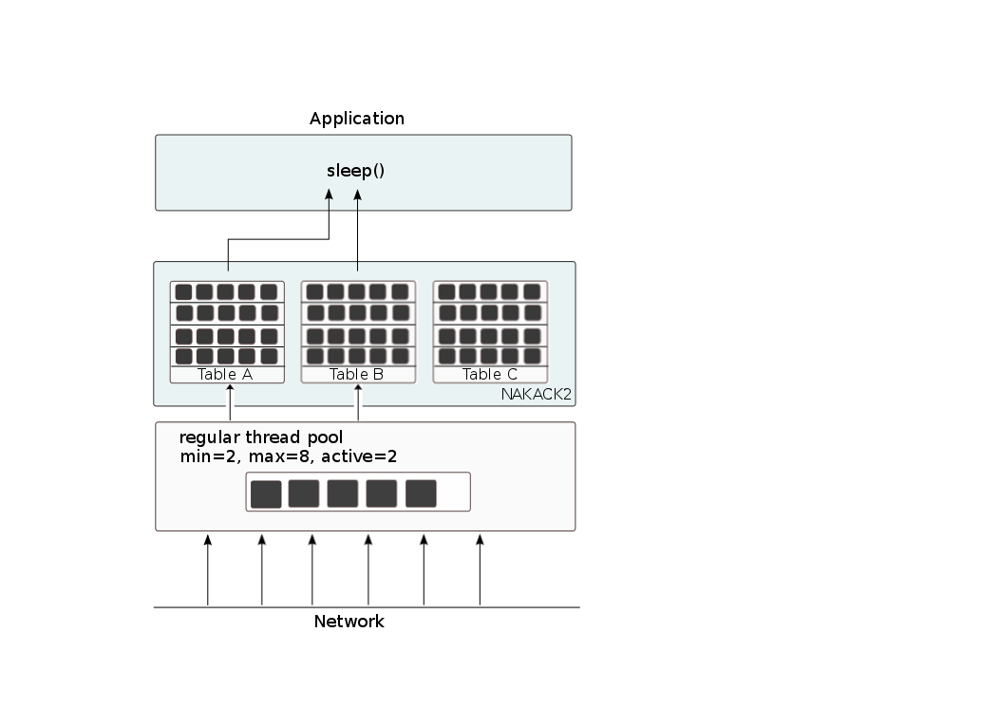
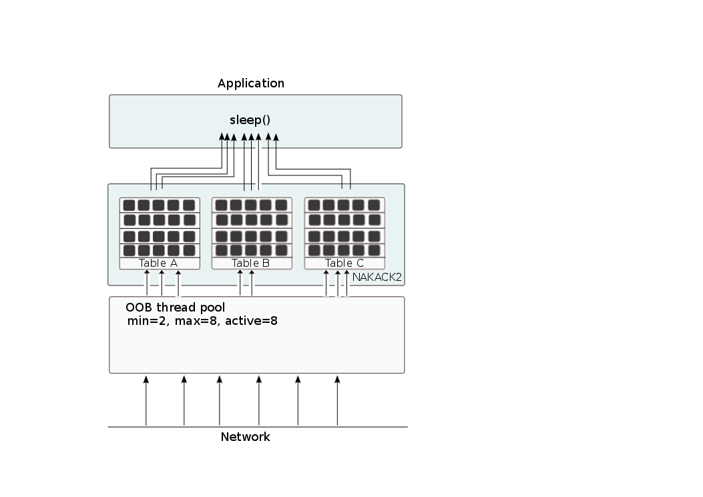

Advanced topics
===============
:author: Bela Ban belaban@yahoo.com
:backend: deckjs
:deckjs_transition: fade
:navigation:
:deckjs_theme: web-2.0
:deckjs_transition: fade
:goto:
:menu:
:toc:
:status:

Message flags
-------------
* Message flags are used to override default behavior of the protocols in a stack
* Examples:
** Mark a message as OOB (out-of-band) to deliver multiple messages from the same sender concurrently
** Skip the flow control protocols
* The advantage of tagging messages is that we don't need to change the configuration, but instead
  can override it on a per-message basis.

* API:

[source,java]
----
public Message setFlag(Flag ... flags);
----

* Example:

[source,java]
----
Message msg=new Message(null, "hello").setFlag(Message.Flag.OOB).name("A");
----

Provided message flags
----------------------
`Message.OOB`: Marks a message as *out-of-band*. OOB messages don't not provide any ordering guarantees,
             although they're are reliable (no loss) and are delivered only once.

`Message.DONT_BUNDLE`: Causes the transport not to bundle the message, but to send it immediately.

`Message.NO_FC`: Bypasses any flow control protocols.

`Message.NO_RELIABILITY`: Bypasses reliable protocols; makes the message unreliable. An unreliable message has no
                       ordering constraints, may get dropped or delivered multiple times.

`Message.NO_TOTAL_ORDER`: If we use a total order configuration with `SEQUENCER`, then we
                         can bypass `SEQUENCER` (if we don't need total order for a given message) with this flag

`Message.DONT_LOOPBACK`: When set, a message is multicast, but not looped back up the stack.
                        Useful when a sender doesn't want to receive its own multicast. +
                        Note that this is a *transient flag*, so `Message.setTransientFlag()` has
                        to be used instead of `Message.setFlag()`. Transient flags are not marshalled with a message.

Ordering of regular messages
----------------------------
* Messages from sender P are delivered sequentially, *in P's send order*
** P sends messages 1-3: P1 is delivered first, then P2, then P3
** P3 has to wait until both P1 and P2 have been processed
* Messages from different senders are delivered in parallel
** P sends messages 1-3 and Q sends messages 1-3; possible deliveries are:
*** At M: `(P1 || Q1-3) -> P2-3` (`||`: parallel, `->`: followed by)
*** At N: `(P1-2 || Q1) -> (Q2-3 || P3)`
** Make sure your `receive()` callback is reentrant

Ordering of OOB messages
------------------------
* OOB messages are delivered *exactly once*, no loss and no duplicates
* However, the delivery order is undefined
* P sending messages 1-3; possible deliveries are:
** At M: `P1-3` (a batch of 3)
** At N: `P2 -> P1 -> P3`

The transport
-------------
* Lowest protocol in the stack
* Serializes messages and puts them on the network
* Receives messages from the network, de-serializes them, and passes them up the stack
* 2 thread pools for handling of incoming messages
. Default thread pool
. Internal thread pool

The big picture
---------------
image::../images/Transport.png[The transport,width=60%",align=left,valign=top]

The default thread pool
-----------------------
* Used to pass received messages up the stack to the application
** Can be configured with min-size, max-size and thread idle time (*no queue*)
*** When all pooled threads are busy, new threads are created (up to max-size)
*** Idle threads are removed from the pool after idle-time
** Can be replaced by a custom thread pool
** Can be disabled
* When all threads are busy, *internal messages are forwarded to the internal pool*
** All other messages are discarded

Configuration of default thread pool
------------------------------------
* A thread pool must `java.util.concurrent.Executor` and the default implementation uses
  `java.util.concurrent.ThreadPoolExecutor`
* The following attributes are used:

[width="90%",cols="2,10", frame="topbot",options="header"]
|====
| Name | Function
|`thread_pool.enabled` | If false, the thread pool is disabled: when a message is received, it is passed up the stack by the receiver thread
|`thread_pool.min_threads` | The min number of threads
|`thread_pool.max_threads` | The max number of threads
|`thread_pool.keep_alive_time` | Time (ms) after which an idle thread should be returned to the pool
|====

The internal thread pool
------------------------
* Handles JGroups internal messages (e.g. heartbeats)
** Can *not* be configured via XML (max-size is computed as a function of the number of cores)
* When full, new threads are spawned (should never happen)
** This needs to be done, so important items (such as timer tasks) are not dropped
** (OOB and regular) messages are retransmitted, so they may be dropped

Assignment of messages to thread pools
--------------------------------------
* This is done by an instance of `MessageProcessingPolicy` (pluggable)
* It determines how messages or message batches are handled (e.g. forwarded to thread pool, queued, dropped etc)
* Currently JGroups ships with 2 policies:
** `SubmitToThreadPool`
** `MaxOneThreadPerSender` (default)
* Can be set / changed via attribute `message_processing_policy` or `setMessageProcessingPolicy(String policy)`

SubmitToThreadPool
------------------
* All messages (or batches) are added to the default thread pool, increasing its size (up to max-size)
* If full, internal messages are forwarded to the internal thread pool, all other messages are dropped

MaxOneThreadPerSender
---------------------
* Subclass of `SubmitToThreadPool`
* OOB and internal messages are handled by the parent `SubmitToThreadPool`
* Regular messages:
** A max of 1 thread is assigned to handle regular messages from a given sender P
** All other messages from P are queued
** When the thread returns, the queued messages for P are submitted to the pool as a message batch
* Benefit: only 1 thread used for each member
** If we have 10 cluster members, and all are sending regular messages, then we need only 10 threads from the pool
   to handle these

Processing regular messages
---------------------------

Processing OOB messages
-----------------------

Available transports
--------------------
* Currently `UDP`, `TCP` and `TCP_NIO2`
* UDP uses _IP multicasting_
** A message to N cluster nodes is sent *once*, as a datagram packet to a multicast (class D) address
*** Class D addresses: `224.0.0.1` - `239.255.255.255` (`224.0.0.x` reserved for host / router pings)
** The switch copies the packet to all ports which have multicast group members
* TCP uses N-1 TCP connections; 1 connection per destination
** A message to N cluster nodes is sent *N-1 times*
*** This generates a lot of traffic
*** 1 thread per connection
* Recommendation: don't use TCP for large clusters, or clusters with a lot of traffic
** But: I've run a 1000 node TCP cluster on Google Compute Engine... :-)
*** http://belaban.blogspot.ch/2014/07/running-jgroups-cluster-in-google.html

TCP_NIO2
--------
* New transport based on non-blocking IO
* Uses a single thread to handle connections, sends and receives
** As optimization, we can have multiple receiver threads
* More scalable than `TCP`
* Default TCP-based transport in the future
** Currently slightly slower than `TCP`

The path of a message from reception to delivery
------------------------------------------------
* `TP.receive()` (`JGroups/src/org/jgroups/protocols/TP.java`)

Lab: advanced 1
---------------
* Run one instance of `bin/advanced.sh`
** A member P has *5 threads invoking synchronous RPCs on all cluster members*
** The called method sleeps for 1 second
* Press `[1] start`
* The first RPC takes 1s, the second 2s, then 3s, 4s, 5s.
* *All subsequent RPCs take 5s. Why ?*

Explanation
-----------
// * What's going on?
// * (Explanation commented, uncomment in the source code to make visible)
* The same sender P has 5 threads invoking synchronous RPCs
* The RPCs are sent as regular messages
* Regular messages from the same sender are delivered sequentially
* The first message is delivered immediately and returns after 1s, the second has to wait for 1s, is delivered and
  returns after 1s and so on
* After some messages, everyone always has 4 messages ahead of it: 4s of wait time plus 1s of actual processing time
** Total processing time of 5s

Possible fixes
--------------
* Fix 1: use OOB messages (see below)
** Press `'o'` to switch to `OOB` RPCs
** Each message now takes 1s to process
** However, messages are delievered in random order (no FIFO-per-sender anymore)
** This also uses more thread of the pool; up to 5 more if all RPCs arrive at the same time
* Fix 2: use the asynchronous invocation API (see below)
** Reduced thread use in the regular and OOB pools, but more use of the application's thread pool

Monitoring
----------
* See the current pending requests (edited):
----
[belasmac] /Users/bela/workshop$ probe.sh  requests
local_addr=A [ip=127.0.0.1:54829, version=4.0.6-SNAPSHOT (Schiener Berg), cluster=advanced, 1 mbr(s)]
requests=134: GroupRequest, mode=GET_ALL, entries:
A: received=false, suspected=false

135: GroupRequest, mode=GET_ALL, entries:
A: received=false, suspected=false

136: GroupRequest, mode=GET_ALL, entries:
A: received=false, suspected=false

137: GroupRequest, mode=GET_ALL, entries:
A: received=false, suspected=false

138: GroupRequest, mode=GET_ALL, entries:
A: received=false, suspected=false
----

* Timing details on RPCs:
[.small]
----
[belasmac] /Users/bela/workshop$ probe.sh rpcs-details

#1 (212 bytes):
local_addr=A [ip=127.0.0.1:54829, version=4.0.6-SNAPSHOT (Schiener Berg), cluster=advanced, 1 mbr(s)]
rpcs-details=
<all>: async: 0, sync: 180, round-trip min/avg/max (us): 5001802.73 / 5011800.38 / 5022800.32
----

Extra credit
------------
* Change Advanced to have invoker threads invoke the RPCs in the background
** Use `RpcDispatcher.callRemoteMethodsWithFuture()` and call `whenComplete()` on the returned `CompletableFuture`.
** Add a small sleep of 500ms between invocations
* What would happen to the thread pool?
* Can this be looked at? Where?
* What's the outcome if we switched to OOB RPCs?

Explanation
-----------
* An invoker thread calls the RPCs but returns immediately
* Each thread sleeps for 500ms between invocations
** This means it generates 2 invocations/sec, but the invocations take 2s to execute
* Because the invocation rate (5 threads generate 10 invocations/sec) is greater than the delivery rate,
  RPCs keep piling up in `MaxOneThreadPerSender`
** The invocation times keep increasing
* OOB RPCs:
** 10 RPCs/sec: because all RPCs are handled in parallel, so it takes 1s for the 10 to get processed
** The largest thread pool size should therefore be ~10:
*** `probe.sh jmx=UDP.thread_pool_`: should show a max pool size of ~10
*** Hmm, incorrect: ~20 is shown as largest thread pool size! Why?
** OOB RPCs are bound by the max-size of the thread pool. Verify this by increasing the number of threads!

Lab: advanced 2
---------------
* Run 3 instances of `bin/advanced.sh`
* in each of them:
** Press `[o]` to use `OOB` RPCs
** Press `[3]` and set the number of threads to 10
* Now start all of them (`[1]`)
* *RPCs take more then 1s. Why?*

Explanation
-----------
* The thread pool is configured as follows: `min=0`, `max=20`
* Each instance has ca. 10 messages (requests and responses) in flight at any given time
* This requires ~30 threads, but the thread pool is configured to a max-size of 20
* We can see the size of the thread pool and the number of rejected messages because of a full pool (edited):

[.small]
----
[mac] /Users/bela/workshop$ probe.sh jmx=UDP.thread_pool_,num_re
UDP={num_rejected_msgs=14, thread_pool_size=20, thread_pool_size_active=14, thread_pool_size_largest=20}
UDP={num_rejected_msgs=25, thread_pool_size=20, thread_pool_size_active=18, thread_pool_size_largest=20}
UDP={num_rejected_msgs=21, thread_pool_size=20, thread_pool_size_active=18, thread_pool_size_largest=20}
----

The largest thread pool size is 20, which means max-size has been reached (and probably exceeded). The
`num_rejected_msgs` attribute shows the number of messages dropped because of a full thread pool.

* Retransmit requests:

[.small]
----
[mac] probe.sh jmx=NAKACK2.xmit_r
NAKACK2={xmit_reqs_received=65, xmit_reqs_sent=60, xmit_rsps_received=55, xmit_rsps_sent=65}
NAKACK2={xmit_reqs_received=75, xmit_reqs_sent=68, xmit_rsps_received=62, xmit_rsps_sent=75}
NAKACK2={xmit_reqs_received=59, xmit_reqs_sent=71, xmit_rsps_received=60, xmit_rsps_sent=59}
----

Here we can see the number of retransmit requests and responses. Typically, these numbers should be
very low or 0. Running this command multiple times, or using a tool such as `watch`, we can see
that they are increasing over time.

Possible fixes
--------------
* Increase `UDP.oob_thread_pool.max_size` to 50:
----
probe.sh op=UDP.setOOBThreadPoolMaxThreads[50]
----
* Now each request takes ~ 1s again

Thread pool sizing
------------------
* Set min-size to 0
* How about max_size?
* Keep track of the average and max active threads
** This should give you a good estimate of what the max-size should be
* Or just don't bother and set max-size to a large value!
** Threads will not be created until needed and idle threads will be removed from the pool
   after max-idle-time anyway
** See monitoring section in the Admin part

Asynchronous invocation API
---------------------------
* A method invoked in an RpcDispatcher is dispatched to application code
  by calling method handle in `RequestHandler`:

[source,java]
----
public interface RequestHandler {
    Object handle(Message msg) throws Exception;
}
----

* `RpcDispatcher.handle()` converts the message's contents into a method call,
  invokes the method against the target object and returns the result. The return value
  is then marshalled and sent back to the caller.

* The invocation is *synchronous*, ie. done on the thread dispatching the
  message from the network up to the application. The thread is
  *busy* for the duration of the method invocation.

* If the invocation takes a while, e.g. because locks are acquired or the application waits on some I/O,
  another thread will be used for a different request. This can quickly lead to the thread pool being
  exhausted or many messages getting queued if the pool has a queue.

* Therefore a new way of dispatching messages to the application was devised; the *asynchronous invocation API*
* A new interface `AsyncRequestHandler` (extending `RequestHandler`) was introduced

* This allows a request thread to be returned to the thread pool immediately, and the response to be sent later when
  the request has completed

AsyncRequestHandler
-------------------

[source,java]
----
public interface AsyncRequestHandler extends RequestHandler {
    void handle(Message request, Response response) throws Exception;
}
----

* `AsyncRequestHandler` adds a method taking a request message and a `Response` object.
* The request contains the same information as before (e.g. a method call plus args)
* `Response` is used to send a reply later, when processing is done.

[source,java]
----
public interface Response {
    void send(Object reply, boolean is_exception);
}
----

* `Response` has information about the request (e.g. request ID), and `send()` send a response.
  The `is_exception` parameter should be true if the reply is an exception, e.g.
  was thrown when `handle()` ran application code.

* The advantage of the new API is that it can be used asynchronously. The default
  implementation uses a synchronous invocation:

[source,java]
----
public void handle(Message request, Response response) throws Exception {
    Object retval=handle(request);
    if(response != null)
        response.send(retval, false);
}
----

* Method `handle()` synchronously calls into application code and returns a result, which is
  sent back to the sender of the request.

Use of the asynchronous invocation API
---------------------------------------
* An application can subclass `RpcDispatcher`, or it can set a custom request handler via
  `setRequestHandler()`, and implement `AsyncRequestHandler.handle()` by
  dispatching the processing to an *application thread pool*.

* The JGroups thread handling the request is released immediately and can be used to process other messages.

* The response will be sent when the invocation of application code is done, and thus the thread is not blocked
  on I/O, or trying to acquire locks that blocks in application code.

* To set the mode which is used, method `RpcDispatcher.asyncDispatching(boolean)` is used. This can be
  changed even at runtime, to switch between sync and async invocation style.

* Asynchrounous invocation is typically used in conjunction with an _application thread pool_. The application
  knows (JGroups doesn't) which requests can be processed in parallel and which ones can't.

* Benefit: request dispatching (and ordering !) is now under application control

* Caution: because ordering is done by the application; *the order established by JGroups can be destroyed!*
** E.g. P1 and P2 (sender-ordered) are delivered by JGroups and the application adds them to its thread pool. There's
   no guarantee in which order P1 and P2 are processed.

Example: replicated web sessions
--------------------------------
* If a cluster node A has 1000 web sessions, then replication of updates across the cluster generates messages from A.
* Because JGroups delivers messages from the _same_ sender _sequentially_, even
  updates to unrelated web sessions are delivered in strict order.
* With asynchronous invocation, the application could devise a dispatching strategy which assigns updates to
  different (unrelated) web sessions to any available thread from the pool, but queues updates to the same
  session, and processes those by the same thread, to provide ordering of updates to the same session.
** This would speed up overall processing, as updates to a web session 1 on A don't have to wait until all
   updates to an unrelated web session 2 on A have been processed.

Lab: advanced 4
----------------
* Run `bin/advanced.sh -use_async_handler`
* Run `jconsole` and observe attributes of `advanced:advanced-obj`
** Alternative: `probe.sh adv`
** The app-thread-pool's size is 5
** Note that the regular thread pool's size is 0 !
* So what happened ?
** The thread delivering a message returns immediately because the `AsyncRequestHandler` processes the message in a
   separate thread
** JGroups considers 'returning' as delivered
*** This allows the thread to grab the next message
** The caller still blocks until it receives the response
** Note that the order of messages is now defined by the application thread pool

Message batching
----------------
* For historic reasons, the term *message bundling* is used on the sender, *message batching* on the receiver
** Let's use the term *batching* only
* When sending many smaller messages, it is better to queue them and send them as a _message batch_
** Payload / header ratio is better (e.g. payload of 5, header of 30 !)
* Simple sender algorithm:
----
LOOP(while there are messages pending for destination D):
    - If the message batch size for D is < max bundle size: add the message to the batch
    - Else: send the batch, create a new batch for D and add the message
ENDLOOP
- Send batch if size > 0
----
* This collects many messages into a batch until `max_bundle_size` has been reached, but sends individual messages
  immediately
* E.g. message P1-5 are sent at time T1, and P6 at time T20: this create a batch for P1-5 and a single message for P6

Message batching on the receiver
--------------------------------
* On the receiver, we create instances of `MessageBatch` for batches (one for each destination) and pass the batches
  up rather than the individual messages
* Advantages:
** Multiple messages can be processed in one go
** Locks are acquired once for a batch (say of 10) rather than 10 times -> less context switching
** `NAKACK` / `UNICAST`: add N messages into the retransmission table *in one step* rather than *N steps*
** The destination and sender addresses are sent *only once rather than N times*
* API for reception of a batch (`Receiver`):
[source,java]
----
public void receive(MessageBatch batch);
----

Do I have to change my code?
----------------------------
* No: by default `receive(MessageBatch)` calls `receive(Message)` for each message in a batch
* However, it may be more efficient to process multiple messages in one go

NOTE: messages in a regular message batch should still be processed in order, or else ordering is destroyed

Generating custom addresses
---------------------------
* Address generation is pluggable: an application can make JGroups use custom addresses.
* To use custom addresses, `org.jgroups.stack.AddressGenerator` has to be implemented:

[source,java]
----
public interface AddressGenerator {
    Address generateAddress();
}
----

* The default address type is `UUID`
* Use `ExtendedUUID` (subclass of `UUID`) as custom address.
** Can be used to pass additional data around with an address, for example information
   about the location of the node to which the address is assigned
* Example: here we create an `ExtendedUUID` and add the hostname to it under key `host`:

[source,java]
----
JChannel ch=new JChannel();
ch.addAddressGenerator(() -> {
        ExtendedUUID retval=ExtendedUUID.randomUUID();
        retval.put("host", getHostName().getBytes());
        return retval;
    });
ch.connect("cluster");
----

Controlling view generation
---------------------------
* View generation is pluggable; application code can be called to create a view
* The first member of a view is always the _coordinator_
** The application can therefore pick the coordinator
** Useful to
*** Pin the coordinatorship to only certain 'beefy' servers
*** Make sure that one of the previous coordinators becomes the new coordinator after a merge. This
    reduces the frequency at which the coordinator moves around and increases stability for
    singleton services.
* To do this, interface +MembershipChangePolicy+ has to be implemented

[source,java]
----
public interface MembershipChangePolicy {
  List<Address> getNewMembership(Collection<Address> current,            // <1>
                                 Collection<Address> joiners,
                                 Collection<Address> leavers,
                                 Collection<Address> suspects);
  List<Address> getNewMembership(Collection<Collection<Address>> views); // <2>
}
----
<1> Create a regular view: `current_members` is a list of the current members, `joiners`
  of new members, `leavers` of members which want to leave and `suspects` of members which have crashed
<2> Accepts a list of membership lists; each list is a subview that needs to get merged into a new `MergeView`

Generating a MergeView
----------------------
* For example, we could have +{A,B,C}+, +{M,N,O,P}+ and +{X,Y,Z}+:
* A, M and X are the respective coordinators of the subviews and the task of the code
  is to determine the _single coordinator_ of the merged view.
* The default implementation
** adds all subview coordinators to a sorted set,
** takes the first (say M), adds it to the resulting list and then
** adds the subviews in turn.
* This could result in a MergeView like +{M,A,B,C,N,O,P,X,Y,Z}+.
* Ordering and duplicate elements
** In both regular and merge views, it is important that there are _no duplicate members_. It is
   possible to get overlapping subviews in the case of a merge, for instance:
   +{A,B,C}+, +{C,D}+ and +{C,D}+. This _cannot_
   result in C or D being present in the resulting merge view multiple times.
* A +MembershipChangePolicy+ can be set in `GMS` via property `membership_change_policy`,
  which accepts the fully qualified classname of the implementation of `MembershipChangePolicy`.
** There is also a setter +setMembershipChangePolicy()+ which can be used to set the change policy programmatically

Sample view generation
----------------------
* The following example shows how to pin coordinatorship to a certain subset of nodes in a cluster.
* Beefy nodes need to be marked as such, and this is done by using a special address, generated by an
  `AddressGenerator`:

[source,java]
----
if(beefy)
    channel.setAddressGenerator(() -> {
            return ExtendedUUID.randomUUID(channel.getName());
    });
----

* First we check if the node that's started needs to be marked as beefy. If so, we grab the current channel
  and set an `AddressGenerator` which creates an `ExtendedUUID`.
* The +MembershipChangePolicy+ now knows if a node is beefy by checking if the node's
  address is an `ExtendedUUID`.

A sample MembershipChangePolicy
-------------------------------

[source,java]
----
public List<Address> getNewMembership(Collection<Address> current,
                                      Collection<Address> joiners,
                                      Collection<Address> leavers,
                                      Collection<Address> suspects) {
    Membership retval=new Membership();
    for(Address addr: current_members)
        if(addr instanceof ExtendedUUID)
            retval.add(addr);
    for(Address addr: joiners)
        if(addr instanceof ExtendedUUID)
            retval.add(addr);
    retval.add(current_members).add(joiners);
    retval.remove(leavers).remove(suspects);
    return retval.getMembers();
}
----

* Beefy servers are at the head of a view. When a new beefy server joins, it should _not_ become the new
  coordinator if the current coordinator already _is_ a beefy server, but add itself to the end of the beefy
  servers, ahead of non-beefy servers.
* First we create a +Membership+, which is an ordered list without duplicates. Then we iterate through
  the current membership and add the beefy servers to the list, followed by the beefy joiners.
* After that, we add all other current members and joiners and remove suspected and leaving members.
* Effect: while there are beefy servers in a view, the oldest beefy server will be the coordinator,
  then the second-oldest and so on.
** When no beefy servers are available, the oldest non-beefy server will be coordinator.
** When a beefy server joins again, it will become coordinator, taking the coordinatorship away from the
   previous non-beefy server.

Fork channels
-------------
* A fork channel is a light-weight channel, forked off of a main channel (`JChannel`)
** Used as a private communication channel for a subsystem
** Additional protocols can be attached to a fork channel
** A fork channel only lives as long as the main channel lives
** Subclass of `JChannel`; but some methods are not supported (e.g. state transfer)
* Can be created declaratively (at main channel creation time) or dynamically using the programmatic API
* Use cases for fork channels:
** No need to configure a separate channel; use of an existing `JChannel` (e.g. grabbed
  from Infinispan or WildFly) for private communication
** If we cannot for some reason modify the main stack's configuration, we can create a fork channel and
   a corresponding fork stack and add the protocols we need to that fork stack. Example:
*** An application needs a fork stack with `COUNTER` (a distributed atomic counter) on top
*** To do so, it can create a fork stack with `COUNTER` and a fork channel connecting to that stack, and it will now
    have distributed atomic counter functionality on its fork stack, not available in the main stack

NOTE:
Fork channels are exposed directly in WildFly 9

Architecture of fork channels
-----------------------------

image::../images/ForkArchitecture.png[Fork channels,width="60%"]

* In the example, a main channel and 5 fork channels (in the same JVM) are shown

* The brown stack to the left is the main stack and it has the main channel connected to it
** The `FORK` protocol needs to be present in the main stack, or else fork stacks can not be created
** It has 2 fork stacks: `"counter"` and `"lock"`

* The blue stack in the middle is a fork-stack with fork stack ID `"counter"`
** It adds protocol `COUNTER` to the protocols provided by the main stack
** Therefore a message passing down through fork stack `"counter"` will pass through protocols `COUNTER` -> `FORK` ->
   `MFC` -> `GMS`

Architecture of fork channels
-----------------------------
* Fork channels have an ID, e.g. `"fork-ch1"`
* The combination of fork stack ID and fork channel ID is used to demultiplex incoming messages
* If fork channel 2 sends a message, it'll pass through `COUNTER` and into `FORK`
** `FORK` adds a header to the message, containing `fork channel ID="fork-ch2"` and `fork stack ID="counter"`
** Then the message passes down the main stack, through `MFC`, `GMS` and so on
* When the message is received, it passes up the reverse order: `GMS` -> `MFC` -> `FORK`
** If there is no header, `FORK` passes the message up the main stack, where it passes through `FRAG2` and ends up
   in the main channel
** If a header is present, the fork stack ID is used to find the correct fork-stack (`"counter"`).
** The message then passes through `COUNTER`
** Finally, the fork channel ID (`"fork-ch2"`) is used to find the right fork channel and the message is passed to it
* Fork channels sharing the same fork stack also share state
** For example, fork channels `fork-ch1` and `fork-ch2` share `COUNTER`, which means they will see each other's
   increments and decrements of the same counter
** If fork stack `"lock"` also had a `COUNTER` protocol, and `fork-ch1` anf `fork-ch4` accessed a counter with
   the same name, they would still not see each other's changes, as they'd have 2 different `COUNTER` protocols.

FORK configuration
------------------

[source,xml]
----
<FORK>
    <fork-stacks>
        <fork-stack id="counter">
            <config>
                <COUNTER bypass_bundling="true"/>
            </config>
        </fork-stack>
        <fork-stack id="lock">
            <config>
                <CENTRAL_LOCK num_backups="2"/>
                <STATS/>
            </config>
        </fork-stack>
    </fork-stacks>
</FORK>
----

* `FORK` defines 2 fork stacks: `"counter"` and `"lock"`
* The stack definition is defined with `<fork-stack>` elements
** For example, fork stack `"lock"` creates a stack with `CENTRAL_LOCK` and `STATS`
* When `FORK` is initialized, it will create the 2 fork stacks
* Fork channels can pick one of the 2 existing fork stacks to be created over,
  or they can dynamically create new fork stacks

Creation of fork channels
-------------------------
* A fork channel is created by instantiating a new `ForkChannel` object:

[source,java]
----
JChannel main_ch, fork_ch;                            // <1>
fork_ch=new ForkChannel(main_ch, "lock", "fork-ch4",  // <2>
                        new CENTRAL_LOCK(), new STATS());
main_ch.connect("cluster");
fork_ch.connect("bla");                               // <3>
----
<1> This is the main channel. Its stack may or may not contain `FORK`, but for this example, we
    assume it is present.
<2> The fork channel is created. It is passed the main channel, the fork stack ID (`"lock"`) and the
    fork channel ID (`"fork-ch4"`), plus a list of already created protocols (`CENTRAL_LOCK` and `STATS`). If
    `FORK` already contains a fork stack with ID=`"lock"`, the existing fork stack will be used, or else a new
    one will be created with protocols `CENTRAL_LOCK` and `STATS`. Then a new fork channel with ID=`"fork-ch4"` will
    be added to the top of fork stack `"lock"`. An exception will be thrown if a fork channel with the same ID
    already exists.
<3> The `ForkChannel` now calls `connect()`, but the cluster name is ignored as fork channels have the same
    cluster name as the main channel they reference. The local address, name, view and state are also the same.
    Note that the main channel needs to be connected _before_ any fork channel.

* The lifetime of a fork channel is always dominated by the main channel: if the main channel is closed, all
  fork channels atttached to it are in closed state, too, and trying to send a message will throw an exception.

Dynamically inserting a FORK protocol
-------------------------------------
* The example above showed the simplified constructor, which requires the `FORK` protocol to be present in the
  stack. There's another constructor which allows for FORK to be created dynamically if not present:

[source,java]
----
public ForkChannel(final JChannel main_channel,
                   String fork_stack_id, String fork_channel_id,
                   boolean create_fork_if_absent,
                   int position,
                   Class<? extends Protocol> neighbor,
                   Protocol ... protocols) throws Exception;
----

* In addition to passing the main channel, the fork stack and channel IDs and the list of protocols, this
  constructor also allows a user to create `FORK` in the main stack if not present. To do so,
  `create_fork_if_absent` has to be set to true (else an exception is thrown if `FORK` is not found), and the
  neighbor protocol (e.g. `FRAG2.class`) has to be defined, plus the position (`ProtocolStack.ABOVE/BELOW`)
  relative to the neighbor protocol has to be defined as well.

* The design of FORK / ForkChannel is discussed in more detail in
  link:$$https://github.com/belaban/JGroups/blob/master/doc/design/FORK.txt$$[https://github.com/belaban/JGroups/blob/master/doc/design/FORK.txt]

Handling network partitions (split brain)
-----------------------------------------
* Cluster: `v4={A,B,C,D,E}` (coord=`A`)
* Assume a switch connecting to members `{D,E}` fails -> network partition between `{A,B,C}` and `{D,E}`
** `A`, `B` and `C` can ping each other, but not `D` or `E`, and vice versa
* JGroups detects this and creates 2 subclusters: `v5={A,B,C}` (`A` remains coordinator) and `v5={D,E}` (`D` becomes coord)
* Clients may be able to access one or both of the partitions (or none)
* When the partition heals, JGroups will merge the subclusters back into _MergeView_ `v6={A,B,C,D,E}`
** A MergeView has a list of all subviews (partitions)
*** We know which members were part of which partition before the split healed
* However, JGroups won't be able to merge the (possibly divergent) _application data_

Strategies for keeping application data consistent
--------------------------------------------------
* CAP: either CP or AP (P can never be forfeited as partitions do happen)
* CP: consistency & partition handling
** System may not be available all the time
** jgroups-raft
* AP: availability & partition handling
** Consistency not guaranteed all the time
** Eventual consistency: possibility to see stale data but eventual convergence of data
** Infinispan eventual consistency

Consistency and partition handling (CP)
---------------------------------------
* Only a majority partition is allowed to perform reads and writes
** The majority partition can also be defined differently as long as the decision is deterministic
   (only one majority partition), e.g.
*** A given node needs to be present
*** Access to a given resource (e.g. DB)
**** Whoever has access to the DB is allowed to write, others shut down or become read-only
* A minority partition rejects client access (stale reads might be allowed)
* Advantage: no merging of data
* Disadvantage: system unavailable when no majority

Example: primary partition handling
-----------------------------------

[source,java]
-----
static final int majority=3;
boolean is_primary;

public void viewAccepted(View new_view) {
    int size=new_view.size();
    if(is_primary) {
        if(size < majority) {
            is_primary=false;
            // go into read-only mode (or reject all requests)
        }
    }
    else {
        if(size >= majority) {
            is_primary=true;
            // 1. go into read-write mode
            // 2. overwrite state with state from primary partition
        }
    }
}
-----
* A cluster becomes a primary partition as soon as it has `majority` members
* A read-only, non-primary partition exists when the view size drops below `majority` members

Availability and partition handling (AP)
----------------------------------------
* All partitions are allowed to make progress (read-write)
* Partitions can diverge if the same data is modified in different partitions
* When the network partition heals, data has to be merged
* Merge strategies:
** Timestamps, physical time, logical clocks
** Member precedence
** Causal vectors (_eventual consistency_)
*** Has to contact application if data collision cannot be resolved automatically
* Advantage: system is always available and accepts writes
* Disadvantage: merging data can be hard (and we may have to consult the application)

Writing a protocol
------------------
* Let's write a simple protocol which prints the number of bytes for each sent or received message to stdout
* To do this, we have to extend `Protocol`:

[source,java]
----
@MBean(description="A sample protocol printing the number of bytes of all received messages")
public class PRINT_BYTES extends Protocol {
    protected static final short ID=2015;

    static {
        ClassConfigurator.addProtocol(ID, PRINT_BYTES.class);
    }

    @Property(description="Suppresses printing to stdout if false")
    protected boolean do_print=true;
}
----
* The `@MBean` annotation makes all attributes and operations available via JMX (see below)
* Each protocol has a unique ID, which needs to be registered
** The IDs of all JGroups protocols are defined in `conf/jg-protocol-ids.xml`
* There's a property `do_print` which can be set via configuration and JMX, e.g. `<PRINT_BYTES do_print="false".../>`

Methods to be overridden
------------------------
* The table below lists the most important methods to be overridden by a protocol:

[align="left",width="90%",cols="2,10",options="header"]
|=================
|Name|Description
|init()|Called at initialization time, after all properties have been set from the config file
|start()|Called on `JChannel.connect()`
|stop()| Called on `JChannel.disconnect()`
|destroy()| Called when a channel is closed (`JChannel.close()`)
|down(Event)| Called when an event (e.g. a message) is sent
|up(Event)| Called when an event (e.g. a message) is received
|up(MessageBatch) | Called when a message batch is received
|=================

A few facts about protocols
---------------------------
* Each protocol has a neighbor above it (`up_prot`) and below it (`down_prot`)
* _Events_ are passed between protocols
** An Event has a `type` and `arg` (`Object`)
*** E.g. `type`=`VIEW_CHANGE` -> `arg` = `View`
*** `type`=`MSG` -> `arg`=`Message`

Example: printing a view change
-------------------------------

[source,java]
----
public Object down(Event evt) {  // <1>
    switch(evt.getType()) {      // <2>
         case Event.VIEW_CHANGE: // <3>
             View view=(View)evt.getArg(); // <4>
             System.out.println("view = " + view);
             break;
    }
    return down_prot.down(evt);
}
----
<1> Intercepting a view change in the down direction
<2> Switching based on the type of the event
<3> Handling a view change
<4> Getting the argument and casting it to a `View`

Caveats
-------
* GMS sends a `VIEW_CHANGE` up and down
* If `PRINT_BYTES` is *above* GMS, it won't handle the view change
** Need to handle `VIEW_CHANGE` in the down and up direction

Printing the sent messages
--------------------------
* To do this, we need to override `down()`:

[source,java]
----
case Event.MSG:
    if(do_print) { // <1>
        Message msg=(Message)evt.getArg(); // <2>
        int num_bytes=msg.getLength();     // <3>
        if(num_bytes > 0)
            System.out.printf("-- sending %d bytes\n", num_bytes);
    }
    break;
----
<1> Only print if `do_print` is true
<2> Cast the event's argument to `Message`
<3> `Message.getLength()` returns the number of bytes of the message's payload

Printing the received bytes
---------------------------
* We have to override methods `up(Event)` and `up(MessageBatch)`
* `up(Event)` is more or less the same code as `down(Event)`
* `up(MessageBatch)`:

[source,java]
----
public void up(MessageBatch batch) {
    int total_bytes=0;
    for(Message msg: batch)
        total_bytes+=msg.getLength();
    // alternative: total_bytes=batch.length();
    System.out.printf("received batch of %d messages: total size is %d bytes\n",
                      batch.size(), total_bytes);
    if(!batch.isEmpty())
        up_prot.up(batch);
}
----

Register dynamically to JMX
---------------------------
* Add the following code to `PRINT_BYTES` protocol

[source,java]
----

@ManagedOperation(description="Dynamically register with JMX")
public synchronized void register(boolean register) {
    TP tp=getTransport();
    JChannel ch=getProtocolStack().getChannel();
    String clustername=tp.getClusterName();
    MBeanServer srv=Util.getMBeanServer();
    try {
        if(register)
            JmxConfigurator.registerChannel(ch), srv, clustername);
        else
            JmxConfigurator.unregisterChannel(ch, srv, clustername);
    } catch (Exception e) {
        log.warn(e.getMessage(), e);
    }
}
----
* You can now call the managed operation to register/unregister dynamically the JGroups channel
  to the JMX MBeanServer using probe.sh
----
probe.sh op=PRINT_BYTES.register[true]
----

Running the demo
----------------
* Add `PRINT_BYTES` to `config.xml`:

[source,xml]
----
<UDP mcast_addr="228.5.5.5".../>
<org.lab.protocols.PRINT_BYTES do_print="true" />
<PING />
 ...
----

* Note that the full classname of `PRINT_BYTES` has to be given
* Run the demo: `bin/repl-cache.sh`
* Extra credit
. Maintain the number of sent messages / bytes in variables and expose them with `@ManagedAttribute`
. Disable and re-enable printing of messages via probe.sh
. Print the headers (`Message.printHeaders()`)
. Dynamically remove `PRINT_BYTES` via `probe.sh remove-protocol ...`

Debugging
---------
* Failure detection protocols depending on heartbeats should be disabled
* Otherwise, stopping member P in a breakpoint for more than the failure detection timeout would
  suspect and exclude P
** Disable FD_ALL, FD
** FD_SOCK is fine
* Alternatively stop only the current thread (config in debugger)

Simulation
----------
* JGroups ships with a number of protocols for simulation of
** Message drops: `DISCARD`
** Network partitions: `DISCARD` (demo)
** Duplicate messages: `DUPL`
** High latency: `DELAY`
** Message reordering: `SHUFFLE`
* These are used in unit tests to test correctness of protocols
** Example: `DuplicateTest`

Byteman
-------
** Adding behavior to a running JVM via dynamic byte code rewriting
** Even to a JVM that was started _without a byteman agent_ (with `bminstall`)
** Dynamically install byteman rules (`bmsubmit`), e.g. to print the bytes of sent / received messages
** Byteman rules can be removed at runtime -> no overhead
** Can be used even in production

Byteman demo
------------
* Make sure `JAVA_HOME` is set or copy `tools.jar` from the JDK to `workshop/lib`
* Run a ChatDemo, e.g. `./run.sh org.lab.ChatDemo -name A -props config.xml`
* Find out the Java process ID:
----
[mac] /Users/bela$ jps -l
70246 sun.tools.jps.Jps
70235 org.lab.ChatDemo
----
* Install the byteman agent: `./bm-install.sh 70235`
* Install the test rule: `./bm-submit.sh ../conf/byteman.btm`
* See that the rule is installed: `./bm-submit -l`
* Observe all events sent by the transport are printed
----
hello
--> MSG, arg=[dst: <null>, src: A (1 headers), size=6 bytes] (headers=NAKACK2: [MSG, seqno=1])
> [A]: hello
world
--> MSG, arg=[dst: <null>, src: A (1 headers), size=6 bytes] (headers=NAKACK2: [MSG, seqno=2])
> [A]: world
--> GET_PHYSICAL_ADDRESS, arg=A
--> MSG, arg=[dst: <null>, src: <null> (1 headers), size=0 bytes, flags=INTERNAL, transient_flags=DONT_LOOPBACK] (headers=MERGE3: INFO: view_id=[A|0], logical_name=A, physical_addr=127.0.0.1:63360)
----
* Uninstall the rule: `./bm-submit -u`

