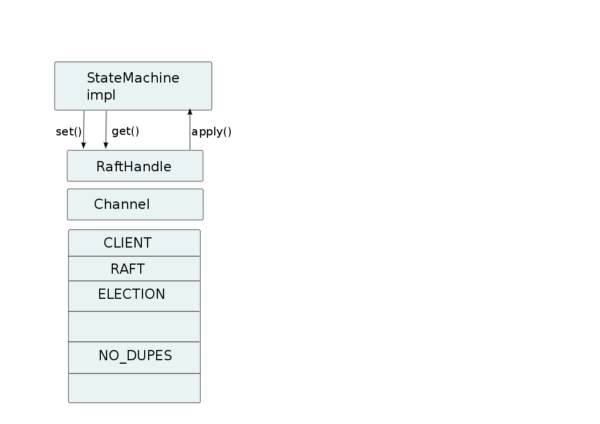

Handling network partitions
===========================
:author: Bela Ban belaban@yahoo.com
:backend: deckjs
:deckjs_transition: fade
:navigation:
:deckjs_theme: web-2.0
:deckjs_transition: fade
:goto:
:menu:
:toc:
:status:

Network partitions (split brain)
--------------------------------
* Cluster: `v4={A,B,C,D,E}` (coord=`A`)
** Members `{D,E}` are in a different subnet, connected to `{A,B,C}` by a switch
* Assume the switch connecting the 2 subnets fails -> the network is partitioned into `{A,B,C}` and `{D,E}`
** The members in `{A,B,C}` can ping each other, but not `{D,E}`, and vice versa
** Each partition thinks the other one is dead -> *split brain*
* JGroups detects this and creates 2 subclusters: `{A,B,C}` (`A` remains coordinator) and `{D,E}` (`D` becomes coord)
** These views may not be installed at exactly the same (wall clock) time
*** E.g. `A` may have installed view `{A,B,C}`, but `E` may still have view `{A,B,C,D,E}` before `{D,E}` is installed
* Clients may be able to access one or both of the partitions (or none)
* When the partition heals, JGroups will merge the subclusters back into _MergeView_ `v6={A,B,C,D,E}`
** A MergeView has a list of all subviews (partitions)
*** We know which members were part of which partition before the split healed
* However, *JGroups won't be able to merge the application data*

Causes for network partitions
-----------------------------
* Switch / router crash
* Garbage collection
* Dropped heartbeat messages
** Full thread pool
** Lossy network
** Buffer overflow
* Misconfiguration (failure detection timeouts too low)

Data inconsistency
------------------
* Partitions `{A,B,C}` and `{D,E}`
* Clients might be able to access both, one or none of the partitions
* A client sets `x=10` in `{A,B,C}` and a different client sets `x=20` in `{D,E}`
* What do we do when the partition heals?
** MergeView: `{A,B,C,D,E}`

image::../images/NetworkPartition.png[Data inconsistency,width="80%",align=left,valign=top]

Strategies for keeping application data consistent
--------------------------------------------------
* Basically 2 strategies:
. Merge the divergent data
** Decide whether `x` should be `10` or `20` in all members of the merged view
** How?
*** Timestamps? Counters?
. Prevent divergent data altogether
** Prevent clients from writing to either partition, or
** Clients can only write to the majority partition `{A,B,C}`

CAP
---
* **C**onsistency, **A**vailability, **P**artition handling
* CAP: either CP or AP (P can never be forfeited as partitions do happen)
* AP: availability & partition handling
** The system is always available
** The system may not always be consistent
** Eventual consistency: possibility to see stale data but eventual convergence of data
** Example: Amazon's Dynamo
* CP: consistency & partition handling
** The system is always consistent
** The system may not be available all the time
** Example: Raft (jgroups-raft)

Availability and partition handling (AP)
----------------------------------------
* All partitions are allowed to make progress (read-write)
* Partitions can diverge if the same data is modified in different partitions
* When the network partition heals, data has to be merged
* Merge strategies:
** Timestamps, physical time, logical clocks
** Member precedence
** Causal vectors (*eventual consistency*)
*** Has to contact application if data collision cannot be resolved automatically
* Advantage: system is always available and accepts writes
* Disadvantage: merging data can be hard (and we may have to consult the application)

Eventual consistency (EV)
-------------------------
* "Dynamo: Amazon's Highly Available Key-Value Store"
** http://www.allthingsdistributed.com/files/amazon-dynamo-sosp2007.pdf
* Each data has a version and a vector clock (array of members plus update count)
* A write updates the vector at the member which performed the write, e.g.:
** `x=10 (v26) A[3], B[2], C[1]` // 3 updates from A, 1 from C and 2 from B
** `x=20 (v27) A[3], B[3], C[1]` // successor to `v26`, B made one more update
* If a vector clock `V2` has the same fields as `V1` and all values are smaller or equal, then `V2` is causally
  related to `V1` (ancestor) and `V1` can be dropped. `v26` above is an ancestor to `v27`
* Otherwise, two vectors are parallel and a read needs to reconcile them:
** `x=10 (v14) A[2], B[3], C[1]`
** `x=20 (v17) A[2], B[2], C[2]`
*** Here, neither vector is a descendent of the other, and therefore, the client needs to be asked for the correct
    value (`x=10` or `x=20`).

Properties of eventual consistency
----------------------------------
* Available even during network partitions (AP)
* Reads and writes always succeed
* Reads may have to ask the client to reconcile divergent data (callback or policy to handle collisions)
* Reading stale data is possible

Consistency and partition handling (CP)
---------------------------------------
* Only the majority partition is allowed to perform reads and writes
** Majority: `N/2+1`
* The majority partition can also be defined differently as long as the decision is deterministic
   (only one majority partition), e.g.
** A given node needs to be present
** Access to a given resource (e.g. DB)
*** Whoever has access to the DB is allowed to write, others shut down or become read-only
* A minority partition rejects client access (stale reads might be allowed)
* Advantage: no merging of data; the data in the majority partition is authoritative
* Disadvantages
** System unavailable when no majority
** Adding / removing members is a bit more involved

Example: primary partition handling
-----------------------------------

[source,java]
-----
static final int majority=3;
boolean is_primary;

public void viewAccepted(View new_view) {
    int size=new_view.size();
    if(is_primary) {
        if(size < majority) {
            is_primary=false;
            // go into read-only mode (or reject all requests)
        }
    }
    else {
        if(size >= majority) {
            is_primary=true;
            // 1. go into read-write mode
            // 2. overwrite state with state from primary partition
        }
    }
}
-----
* A cluster becomes a primary partition as soon as it has `majority` members
* A read-only, non-primary partition exists when the view size drops below `majority` members

What's wrong with this example?
-------------------------------
(Apart from starting more than 5 members. Assume we can only start a max of 5)

* Views are not installed synchronously in all members, example:
** There's a partition between `{A,B}` and `{C,D,E}`
** At `T500`, failure detection in `{C,D,E}` detects connectivity problems, excludes `A` and `B` and installs view
  `{C,D,E}`
*** `{C,D,E}` continues to be the primary partition and accepts write requests
** At `T800`, view `{A,B}` is installed in `A` and `B`; its members are not in the primary partition anymore,
   and write requests are therefore rejected
** However, for 300ms, `A` and `B` continued to accept write requests, and both partitions were primary partitions!

Raft (CP)
---------
* Replicated state machine
* Diego Ongaro's PhD thesis: https://github.com/ongardie/dissertation#readme
* Cluster with a fixed max number of members (additions/removals are possible, but omitted here)
* An *election protocol* elects a *leader*; everybody else is a *participant*
* A request is forwarded to the leader
* The leader computes the log index and broadcasts the request to all members and waits for acks
* Each member appends the received request at the given index and sends an ack to the leader
* The leader commits the element as soon as it has received a majority of acks and then broadcasts a commit message
* Everybody commits on reception of the commit message
** _Committing_ means taking the log entries from the last known commit index up to the current commit index and
   applying them to a state machine, e.g. a replicated hashmap. Log entries could be puts, removes, or even gets

Properties of Raft
------------------
* All progress is made through majority agreement
** If a majority agreed on a value, that log entry can never be changed (a bit like blockchain), even if the leader
   changed
* Leader election is also by majority: this prevents having more than 1 leader at any given time
* If we have less than `N/2+1` members:
** No leader can be elected (unless a leader is already present)
** No entries can be committed: writes fail (they're appended to the log, but cannot be committed). A non-committed
   entry can still be overwritten by entries from a new leader. *Only committed entries cannot be overwritten*.

Example of Raft: jgroups-raft
-----------------------------
* Implementation pretty close to the Raft dissertation
* https://github.com/belaban/jgroups-raft
* jgroups-raft = JGroups + a few protocols (`RAFT`, `ELECTION` etc) + a few utility classes (`RaftHandle`)

jgroups-raft in action
----------------------
* Prerequisite: download and compile jgroups-raft:
** `git clone https://github.com/belaban/jgroups-raft.git ; cd jgroups-raft ; ant`
* Config: `jgroups-raft/conf/raft.xml`
* Start 3 members in separate shells:
** `bin/rsm.sh -name A`
** `bin/rsm.sh -name B`
** `bin/rsm.sh -name C`
* Add a few key/value pairs to the replicated state machine (`[1]`)
* Check in each process that the values are present
* Look at the log (`[5]`) and the contents (`[4]`)
* Now kill member `A` (the leader)
** Observe that eiher `B` or `C` becomes leader
* Add a few key/value pairs -> they're added to `B` and `C`
* Verify that `last-applied` and `commit-log` are the same
* Now kill the participant
* Try adding values:
** There's a TimeoutException
** Observe that `last-applied` is higher than `commit-index`
* Start the second member again
** Observe that `last-applied` and `commit-index` are the same in both members
* Start the third member -> it will also get updated and now all 3 members have the same state and log

Conclusion
----------
* Be aware of the tradeoffs between availability and consistency
* What does your application require?
* JGroups by default provides availability (AP), but does not implement eventual consistency (EC)
** EC can be implemented higher up the stack, e.g. in a replicated cache
* JGroups can be configured to provide consistency (CP) with jgroups-raft

