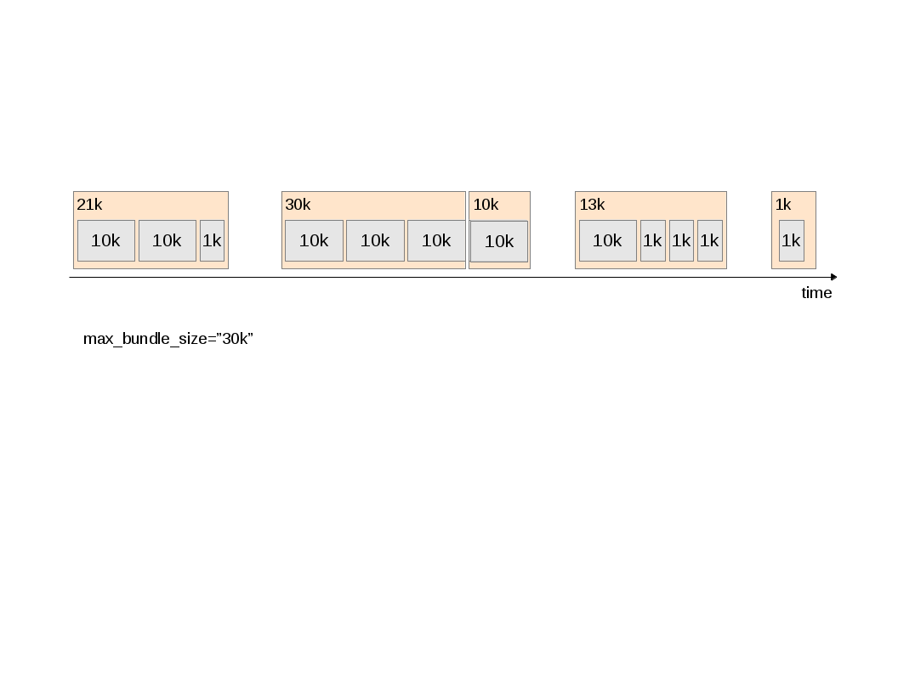
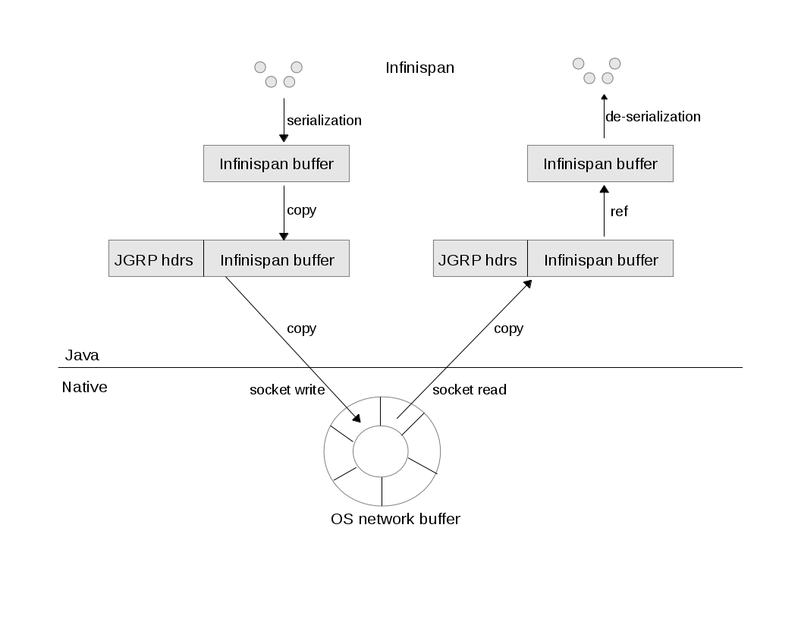
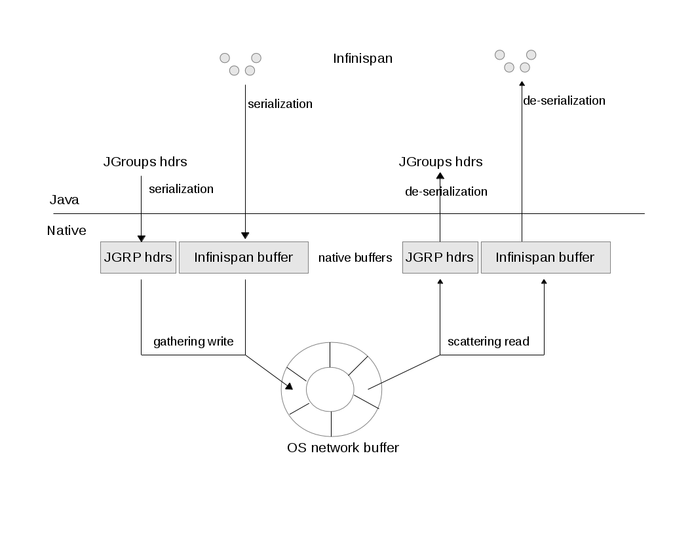

Status JGroups 2012-2014
========================
:author:    Bela Ban
:backend:   slidy
:max-width: 45em
:data-uri:
:icons:

* Status JGroups 2012-2013
** 3.2, 3.3, 3.4, 3.5
* Work planned for 2014 and beyond
** 4.0
* Large scale
** 2000+ nodes
** Google Compute Engine

JGroups 3.2
-----------
* Used in EAP 6.2.0
* Current version: 3.2.12.Final

//Images
//------
//.Yes, you can use images
// 

RELAY2: multi-site clustering
-----------------------------

* https://issues.jboss.org/browse/JGRP-1433[JGRP-1433],
  http://issues.jboss.org/browse/JGRP-1401[JGRP-1401],
  https://issues.jboss.org/browse/JGRP-1521[JGRP-1521],
  https://issues.jboss.org/browse/JGRP-1519[JGRP-1519],
  https://issues.jboss.org/browse/JGRP-1525[JGRP-1525]

* Provides clustering between multiple sites
** Successor to RELAY (which allowed for only 2 sites)
* RELAY2 is added to the of the stack and relays both multicast and
  unicast messages between sites (local clusters) 
* For documentation go to
  http://www.jgroups.org/manual-3.x/html/user-advanced.html#Relay2Advanced

I8N logging
-----------
* https://issues.jboss.org/browse/JGRP-1475[JGRP-1475]
* Use of ResourceBundles to internationalize certain warn and error
  messages
** I'm not convinced a Czech support engineer needs to see French
warning messages...
* The +JGroups/conf/jg-messages*.properties+ files contain the
  translations
** Currently, only English and German are supported, but any language
  can be supported by adding +messages_fr.properties+ to the classpath
* Code reduction
[source,java]
  if(log.isTraceEnabled())
      log.trace(local_addr + ": sent msg " + seqno);

* replaced by
[source,java]
  log.trace("%s: sent msg %d", local_addr, seqno);

Suppress identical log warnings
-------------------------------
* https://issues.jboss.org/browse/JGRP-1518[JGRP-1518]
* Sometimes we get a lot of log messages about the same problem,
  e.g. messages from a non-member, from a different cluster or from a
  member running a different version of JGroups 
** If we get 20'000 messages from a non-member, we'd log 20'000 warnings...
* We can now suppress indentical warnings for a given period of time
  (60s by default), so the logs don't get blown up beyond proportion

JGroups 3.3
-----------

Message batching
----------------
* https://issues.jboss.org/browse/JGRP-1564[JGRP-1564],
  https://issues.jboss.org/browse/JGRP-1581[JGRP-1581] 
* On the receiver, message bundles are passed up in the form of _message batches_. Advantage:
  the cost of passing up messages is amortized; ie. locks
  are acquired only *once per batch* instead of *once per message*.
** Not exposed at the channel level; no +receive(MessageBatch)+
* Example:
[source,java]
    public void up(MessageBatch batch) {
        for(Message msg: batch) {
            FragHeader hdr=(FragHeader)msg.getHeader(this.id);
            if(hdr != null) { // needs to be defragmented
                Message assembled_msg=unfragment(msg,hdr);
                if(assembled_msg != null)
                    batch.replace(msg, assembled_msg);
                else
                    batch.remove(msg);
            }
        }
        if(!batch.isEmpty())
            up_prot.up(batch);
    }

Async Invocation API
--------------------
* https://issues.jboss.org/browse/JGRP-1587[JGRP-1587]
* This allows the recipient of a message in MessageDispatcher or RpcDispatcher to make the delivering thread return
  immediately (making it available for other requests) and to send the response later
* Advantages
** It is the _application_ which now decides how to deliver messages (e.g. sequentially
   or in parallel), and _not JGroups_. The  application knows this better than JGroups
   anyway.
** No clogging of the JGroups thread pools
* Example: Infinispan RPCs accessing different key sets could be delivered concurrently
* Documentation is here: http://www.jgroups.org/manual-3.x/html/user-building-blocks.html#AsyncInvocation.

UNICAST3
--------
* https://issues.jboss.org/browse/JGRP-1589[JGRP-1589]
* New unicast protocol combining the advantages of +UNICAST+ and +UNICAST2+. It has the immediately delivery
  characteristics of +UNICAST+ and the speed of +UNICAST2+ and is the default unicast protocol in 3.3
* Characteristics
** Reduces ack-based traffic while still acking messages quickly (solves
   last-message-lost problem)
*** Message batches are acked as a whole, e.g. batch 20-60 acks only 60
** Prevents problems with concurrent closing and message sending on the same
   connection by flushing pending messages  before closing a connection
** Reduces memory requirements at the sender by quickly purging messages received by the receiver
** Provides selective retransmission (request from receiver to sender)
*** There's not more than 1 ack per +xmit_interval+ period
* For details: https://github.com/belaban/JGroups/blob/master/doc/design/UNICAST3.txt

New thread pool for JGroups-internal messages only
--------------------------------------------------
* https://issues.jboss.org/browse/JGRP-1599[JGRP-1599]
* Added a new thread pool to be used by JGroups only
  (+internal_thread_pool.enabled=true|false+)
* This prevents OOB messages sent by applications to clog the pool and slow internal
  messages such as heartbeats or flow control credits down 

RELAY2 fixes and enhancements
-----------------------------
* https://issues.jboss.org/browse/JGRP-1517[JGRP-1517],
  https://issues.jboss.org/browse/JGRP-1528[JGRP-1528], 
  https://issues.jboss.org/browse/JGRP-1542[JGRP-1542],
  https://issues.jboss.org/browse/JGRP-1543[JGRP-1543],
  https://issues.jboss.org/browse/JGRP-1547[JGRP-1547],
  https://issues.jboss.org/browse/JGRP-1629[JGRP-1629],
  https://issues.jboss.org/browse/JGRP-1623[JGRP-1623]
* When a coordinator crashes, messages are buffered until the new
  coordinator takes over. JGRP-1517 ensures that resending the
  buffered messages occurs before new messages are sent
* JGRP-1528 forwards messages in batches rather than individually, not blocking senders
* JGRP-1542 copies flags of relayed messages, so flags such as OOB are preserved.
* JGRP-1543 provides site-unreachable notifications, so callers know that a site is unreachable.
* JGRP-1547 provides timing stats for forwarding of messages
* JGRP-1629 adds the ability to insert a RELAY2 protocol to an already connected stack

PDC
---
* https://issues.jboss.org/browse/JGRP-1541[JGRP-1541]
* A new protocol to cache discovery responses on disk, suitable for use with (e.g.)
  TCPPING.
* Ref: http://belaban.blogspot.ch/2012/11/persisting-discovery-responses-with.html

SUPERVISOR
----------
* https://issues.jboss.org/browse/JGRP-1557[JGRP-1557]
* New protocol which can auto-correct (or log) things at runtime, based on rules
* Ref: http://belaban.blogspot.ch/2013/01/supervisor-detecting-faults-and-fixing.html

Log4j2 is now the default logging framework used
------------------------------------------------
* https://issues.jboss.org/browse/JGRP-1585[JGRP-1585]
* Log4j is still supported, but log4j2 is preferred (more efficient and less
  blocking)
* Less useless logging code if(log.isCrapEnabled())
** Exception: heavily executed code (there is a small perf penalty)

Pick NIC based on pattern matching
----------------------------------
* https://issues.jboss.org/browse/JGRP-1606[JGRP-1606]
* E.g. +UDP.match_interface="eth*"+

MPerfRpc
--------
* https://issues.jboss.org/browse/JGRP-1625[JGRP-1625]
* New performance test for RPCs

TP: simplified message bundler
------------------------------
* https://issues.jboss.org/browse/JGRP-1540[JGRP-1540]
* The new bundler (enabled by default) is simpler and more efficient than the previous ones
* It queues messages until a max size has been reached, or until no more messages are
  available in the queue, and then sends the queued messages as a message bundle
* The advantage is that we now don't need the +DONT_BUNDLE+ message flag anymore, as either
  the bundle will fill quickly, or no more message is available and so we send the
  message(s) quickly
* This is important for sync RPCs.
* Note that +DONT_BUNDLE+ messages are now bundled, too, so if bundling is to be avoided, the
  +DONT_BUNDLE+ flag has to be used *and* +ignore_dont_bundle+ set to false

3 bundlers
----------
* +sender-sends-with-timer+ (old)
** Sends a message bundle if time has elapsed or queued msgs have exceeded max size
** High latency but good throughput
*** Not good for sync RPCs: use DONT_BUNDLE flag
* +transfer-queue+ (new): 
** All messages are placed in a transfer queue
** Dedicated thread to pull messages and send
*** A message bundle is sent when max size has been exceeded or no other messages are
    in the queue
**** Single messages are sent quickly (DONT_BUNDLE is not needed)
* +sender-sends+ (latest) *in 3.5*:
** A sender thread is used to send the message bundle when max size has been
   exceeded or no other thread is present
** Similar to transfer-queue in latency and throughput
** DONT_BUNDLE is not used anymore

+bundler_type="sender-sends"+
-----------------------------

Characteristics of the 3 bundlers
---------------------------------
* For single threads, +sender-sends+ is the worst, +transfer-queue+ the best
** Single threads always end up sending a single message with +sender-sends+
** With +transfer-queue+, message bundles are sent which is faster
** Comparable to Nagling (TCP_NODELAY): single threads have a better perf if
   it is off
** Discussion: sender sends 1000 messages
*** Flag 1-999 with MORE_MSGS_COMING flag
*** Never send a message is this flag is set (unless max bundle size has
    been exceeded)
*** Send message bundle when flag is absent
**** Requires the notion of a _batch_ (present in Infinispan?)
* For 2 and more threads, +sender-sends+ is about the same as +transfer-queue+,
  +sender-sends-with-timer+ is the best
* For many threads (10 and more), +sender-sends+ has the best performance
* More perf investigation is needed here...
* Eventually I want to remove +sender-sends-with-timer+

New Timer implementation
------------------------
* https://issues.jboss.org/browse/JGRP-1553[JGRP-1553]
* Efficient, faster and simpler than the previous implementations
* This is the default now

STABLE: reduction of time until stability
-----------------------------------------
* https://issues.jboss.org/browse/JGRP-1570[JGRP-1570],
  https://issues.jboss.org/browse/JGRP-1595[JGRP-1595]
* With increasing cluster size, it took much longer to achieve stability, as the time to
  send out a STABLE message was scaled with the cluster size
* This is not done anymore, and we have now by default enabled
  +send_stable_msgs_to_coord_only+
* Members send their STABLE messages to the current coordinator only instead of
  multicasting them to all members
** This cuts traffic, especially with TCP

JGroups 3.4.2
-------------
* 3.4.1 used in EAP 7.x (not yet released)
* Current version: 3.4.2.Final

Pluggable policy for picking coordinator
----------------------------------------
* https://issues.jboss.org/browse/JGRP-592[JGRP-592]
* View and merge-view creation is now pluggable; this means that an application can
  determine which member is the coordinator
** Might be useful to implement cluster singletons in Wildfly
* Documentation: http://www.jgroups.org/manual/html/user-advanced.html#MembershipChangePolicy.

RELAY2: allow for more than one site master
-------------------------------------------
* https://issues.jboss.org/browse/JGRP-1649[JGRP-1649]
* If we have a lot of traffic between sites, having more than 1 site master
increases performance and reduces stress on the single site master

Fork channels: private light-weight channels
--------------------------------------------
* https://issues.jboss.org/browse/JGRP-1613[JGRP-1613]
* This allows multiple light-weight channels to be created over the same (base) channel
* The fork channels are private to the app which creates them and the app can also add
  protocols over the default stack
* These protocols are also private to the app.
* Doc: http://www.jgroups.org/manual/html/user-advanced.html#ForkChannel
* Blog: http://belaban.blogspot.ch/2013/08/how-to-hijack-jgroups-channel-inside.html

Kerberos based authentication
-----------------------------
* https://issues.jboss.org/browse/JGRP-1657[JGRP-1657]
* New AUTH plugin contributed by Martin Swales
* Experimental, needs more work

Probe now works with TCP too
----------------------------
* https://issues.jboss.org/browse/JGRP-1568[JGRP-1568]
* If multicasting is not enabled, probe.sh can be started as follows:
    +probe.sh -addr 192.168.1.5 -port 12345+
, where +192.168.1.5:12345+ is the physical address:port of a node.
* Probe will ask that node for the addresses of all other members and then send the
  request to all members

UNICAST3: ack messages sooner
-----------------------------
* https://issues.jboss.org/browse/JGRP-1664[JGRP-1664]
* A message would get acked after delivery, not reception
* This was changed, so that long running app code would not delay acking the message,
  which could lead to unneeded retransmission by the sender

Compress Digest and MutableDigest
---------------------------------
* https://issues.jboss.org/browse/JGRP-1317[JGRP-1317],
  https://issues.jboss.org/browse/JGRP-1354[JGRP-1354], 
  https://issues.jboss.org/browse/JGRP-1391[JGRP-1391],
  https://issues.jboss.org/browse/JGRP-1690[JGRP-1690]
* When a digest and a view are the same, the +members+ field of the digest points to
  the +members+ field of the view, resulting in reduced memory use.
** The members are marshalled only once.
* View and MergeView now use arrays rather than lists to store
  membership and subgroups
* Delta views: when we have a cluster of 1000 nodes, and new nodes X and Y join while
  B, C and D leave, JGroups used to send a new view of 1001 members to *all* current
  members and to X and Y
** Now the full view is only sent to the new joiners X and Y
** A so called _delta view_ is sent to all existing (1000) members
** A delta view has a ref to the previous view and contains only the joiners and
   leavers
** Every member which receives a delta view computes the new view based on the prev
   view and the deltas
*** This reduces view based traffic *dramatically* for large clusters

Large clusters
--------------
* https://issues.jboss.org/browse/JGRP-1700: uses a bitset rather than a list for STABLE msgs, reducing memory consumption
* https://issues.jboss.org/browse/JGRP-1704: don't print the full list of members
* https://issues.jboss.org/browse/JGRP-1705: suppression of fake merge-views
* https://issues.jboss.org/browse/JGRP-1710: move contents of GMS headers into message body (otherwise packet at
  transport gets too big)
* https://issues.jboss.org/browse/JGRP-1713: ditto for VIEW-RSP in MERGE3
* https://issues.jboss.org/browse/JGRP-1714: move large data in headers to message body

Moved to Ivy for dependency management
--------------------------------------
[source,xml]
<?xml version="1.0" encoding="UTF-8"?>
<ivy-module version="2.0" xmlns:xsi="http://www.w3.org/2001/XMLSchema-instance"
            xsi:noNamespaceSchemaLocation="http://ant.apache.org/ivy/schemas/ivy.xsd">
    <info organisation="org.jgroups" module="jgroups" revision="3.5.0.Alpha1"/>
    <dependencies>
        <dependency org="biz.aQute"                name="bnd"             rev="1.50.0"/>
        <dependency org="bouncycastle"             name="bcprov-jdk15"    rev="140"/>
        <dependency org="org.jboss.byteman"        name="byteman"         rev="2.1.4"/>
        <dependency org="org.jboss.byteman"        name="byteman-bmunit"  rev="2.1.4"/>
        <dependency org="org.jboss.byteman"        name="byteman-install" rev="2.1.4"/>
        <dependency org="org.jboss.byteman"        name="byteman-submit"  rev="2.1.4"/>
        <dependency org="log4j"                    name="log4j"           rev="1.2.14"/>
        <dependency org="org.apache.logging.log4j" name="log4j-api"       rev="2.0-beta9"/>
        <dependency org="org.apache.logging.log4j" name="log4j-core"      rev="2.0-beta9"/>
        <dependency org="xalan"                    name="serializer"      rev="2.7.1"/>
        <dependency org="xalan"                    name="xalan"           rev="2.7.1"/>
        <dependency org="org.testng"               name="testng"          rev="6.8.7"/>
        <dependency org="com.beust"                name="jcommander"      rev="1.5"/>
    </dependencies>
</ivy-module>

JGroups 3.5
-----------

Bundler improvements
--------------------

* New bundler_type names
** +sender-sends-with-timer+, +transfer-queue+
** New bundler +sender-sends+
** See previous discussion

* Send batch of 1 as a single message
** https://issues.jboss.org/browse/JGRP-1726[JGRP-1726]
** Sending a single message is a bit more efficient than sending a message batch of 1

* Ignore DONT_BUNDLE flag
** https://issues.jboss.org/browse/JGRP-1737[JGRP-1737]
** Bundles all messages on the sender, even ones marked with DONT_BUNDLE
*** On the receiver, removes messages marked with DONT_BUNDLE and OOB
   and sends them up as separate messages on a separate thread via the
   thread pool
** Requires a recent bundler (transfer-queue, sender-sends)

Threads processed by the internal thread pool should not do work stealing
-------------------------------------------------------------------------
* https://issues.jboss.org/browse/JGRP-1732[JGRP-1732]
* Even internal threads used to do work stealing
** When done, an internal thread tried to remove messages from the message table
   and pass them up
** Now this is not done anymore
** The point is that internal threads should only do internal work and nothing else
* This prevents the internal thread pool from getting exhausted

Fixed regression between 3.2 and 3.3/3.4
----------------------------------------
* https://issues.jboss.org/browse/JGRP-1716[JGRP-1716]
* Single messages are now parsed by the thread pool again rather than by
  the receiving thread

Enable diagnostics dynamically
------------------------------
* https://issues.jboss.org/browse/JGRP-1747[JGRP-1747]
* Even with diagnostics disabled in the config, there's a method call
  that can turn diagnostics on via JMX or byteman

JGroups 4.0
-----------
* API changes
** Trashing UNICAST, UNICAST2, NAKACK
* NIO.2
** Direct buffers
** Reducing of buffer copying
** Scattering and gathering
** Selector model for UDP and TCP ?

NIO.2: goals
------------
* Reduce buffer copying
** Native buffers
** Gathering writes
*** Infinispan passes its buffer directly to the network socket
** Scattering reads
*** The buffer read from the network socket is passed directly to Infinispan
* Non-blocking
** Reduces threads needed
*** Currently TCP uses a 1 thread-per-connection model
** Not relevant for UDP
* Selector based model
** Common selection based model for all transports (UDP and TCP)
** Parallel use of (multiple?) UDP and TCP transports
*** Flag to select transport type (e.g. select TCP for unicast messages)

Current buffer handling
-----------------------
 

NIO.2 buffer handling
---------------------
 

NIO.2: buffer handling
----------------------
* Buffer reuse
** When can a buffer be released and filled with new data ?
*** Example: JGroups creates a buffer, reads data into it, passes
    +buf/offset/length+ to Infinispan
*** If Infinispan returns immediately and reads the buffer in a different
    thread (e.g. using the Async Invocation API), the buffer cannot be reused
    by JGroups immediately
**** Release API ?
** Should we create new buffers for every read/write or reuse buffers ?
*** Buffers might grow when receiving large messages
*** Penalty for creation of native buffers (slow)
* Make the choice of native versus heap buffers configurable ?
* RDMA
** Use of native buffers should suppress buffer copying on the same box
*** Currently only implemented for TCP (Oracle's JVM)

NIO.2: API changes
------------------
* API changes
** How does Infinispan pass a ref to its buffer to JGroups ?
*** For gathering writes
** Use of +(Byte)Buffer+ rather than +byte[] buffer+ ?
** Use with RpcDispatcher 
*** +(Request,Response)Marshaller+
** Streamable
*** Use of an adapter class (+ByteBuffer(Output,Input)Stream+) ?

NIO.2: selector model
---------------------
* 1 selector thread, thread pools for processing of reads and writes
* UDP and TCP sockets are simply registered with the same selector
* Messages can be sent over different transports
** Message flag to select
*** Defaults: multicasts=UDP, unicasts=TCP
* Issues to investigate
** Do we really need non-blocking for UDP ?

Infiniband support
------------------
* Available for TCP only (no code changes): Sockets Direct Protocol (SDP)
** Solaris and Linux supported by Oracle's JVM
** Define in a config file which connections should bypass TCP and directly use Infiniband
** Use system prop to enable:
[literal]
  java -Dcom.sun.sdp.conf=sdp.conf -Djava.net.preferIPv4Stack=true  ExampleApplication

* Non-transparent support
** JNI to RDMA API (Verbs/OFED API)
** Not really an option; I don't want any C code in JGroups
** I'd rather wait for a Java API for Infiniband in the JDK
*** If there's none, then this shows that there's no demand for Infiniband/Java 

* We should test Infinispan over Infiniband (DIST mode)
* http://docs.oracle.com/javase/tutorial/sdp/sockets

Large clusters
--------------
* Largest cluster is 1500+ nodes
** http://belaban.blogspot.ch/2013/09/new-record-for-large-jgroups-cluster.html
* This resulted in many improvements (see previous slides) from which smaller
  clusters also benefit
* The goal is 2000+

Google Compute Engine
---------------------
* 1000 USD credits to test large JGroups cluster
** Credits expire June 2014, so I have to tackle this soonish

