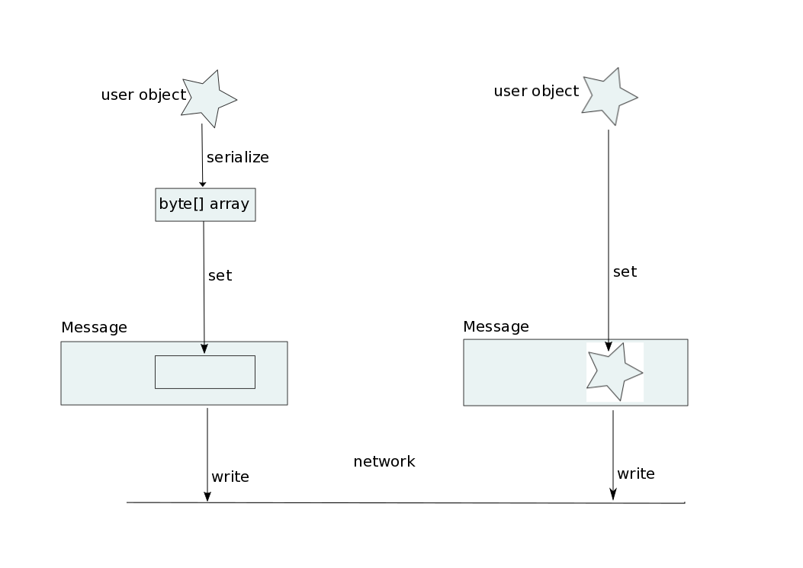

= Status JGroups 2017
:author: Bela Ban belaban@mailbox.org
:backend: deckjs
:deckjs_transition: fade
:navigation:
:deckjs_theme: web-2.0
:goto:
:menu:
:toc:
:status:

= JGroups 4.0

== Receive message batches
* https://issues.jboss.org/browse/JGRP-2003
* JChannel has a new `receive(MessageBatch)` callback:
[source,java]
----
public void receive(MessageBatch batch) {
    for(Message msg: batch) {
        queue.add(msg);
    }
    process(queue); // separate thread
}
----

or
[source,java]
----
public void receive(MessageBatch batch) {
    total_length+=batch.stream().map(msg -> ((Data)msg.getObject()).len)
                                .reduce(0, (l1,l2) -> l1+l2);
}
----
* This was discussed in Como, but IMO hasn't been properly addressed yet

== Problem with message batches
* Regular messages: `| P10 | P11 | P12 ... | P20 |`
** This is FIFO order
** However, some apps might tolerate ordering changes, e.g.
*** If `P12` is a `prepare` message, and `P20` a `rollback`, then `P20` could be delivered immediately.
*** If we have `P5: x=20` -> `P8: x=10` -> `P15: delete(x)`, `P5` and `P8` might get skipped
*** Several `puts` and `gets` to the same cache may want to order `puts`, but apply `gets` in a seperate thread (stale reads)
* OOB messages: `| P15 | P10 | P11 | P20 | P18 | ... |`
** Order is undefined, but each message is delivered exactly once (no dupes, no loss)
** Synchronous writes in Infinispan
*** Triangle: `puts`, `backups`, `acks`:
**** `puts` to the primary: OOB
**** `backups` to the secondary: regular (FIFO)
**** `acks` to the originator: OOB
* Processing a message batch sequentially from head to tail is certainly correct as it does not destroy ordering, but
  it is inefficient
* Applications know their ordering constraints, and can reduce latency by weakening the strong ordering
  established by JGroups!

= JGroups 4.0.1

* Custom code to pick bind address in the transport: +
`bind_addr="custom:com.acme.BindAddressPicker"`
** The class needs to implement `Supplier<InetAddress>`

= JGroups 4.0.2
* `DNS_PING`: https://issues.jboss.org/browse/JGRP-2139 (jgroups-extras)
* Eliminated 1 byte[] array copy in TCP when receiving data: https://issues.jboss.org/browse/JGRP-2165
* Configuration now also uses env variables (in addition to sysprops): https://issues.jboss.org/browse/JGRP-2166
** Needed for `KUBE_PING` (Openshift discovery protocol, see later)

= JGroups 4.0.4

== `GOOGLE_PING2`
* In jgroups-extras
* https://github.com/jgroups-extras/jgroups-google
* Uses a native GCP API, instead of extending `S3_PING` (deprecated)

== `RemoveQueueBundler`
* https://issues.jboss.org/browse/JGRP-2171
* Guaranteed upper boundary on latency

== Non-blocking flow control
* https://issues.jboss.org/browse/JGRP-2172
* Docs: http://www.jgroups.org/manual4/index.html#NonBlockingFlowControl
* When no credits are left, instead of blocking the sender thread -> add the message to a queue and return immediately
* When credits are received -> drain as many messages from the queue as possible
* The queue can be bounded -> still blocking in the end

== Misc
* More bundler stats: https://issues.jboss.org/browse/JGRP-2173

= JGroups 4.0.5

== New discovery protocol `native-s3-ping`
* https://github.com/jgroups-extras/native-s3-ping
* Uses the native S3 API
* `S3_PING` has been deprecated

== New discovery protocol `KUBE_PING`
* https://github.com/jgroups-extras/jgroups-kubernetes
* This is a rewrite of the old `KUBE_PING`
** I removed 50% of the code and a few nasty deps (DMR, JBoss webserver)
* Uses Kubernetes API to discover nodes
* Default in JDG/Openshift/Online

== ASYM_ENCRYPT
* https://issues.jboss.org/browse/JGRP-2133
* https://issues.jboss.org/browse/JGRP-2157
* Dynamic key exchange is liable to mitm attacks
** `SSL_KEY_EXCHANGE` uses SSL to exchange shared key
** Configured with certificate chains
** Client (= joiners) certs are checked, too (not the default with SSL)

== AUTH issue
* https://issues.jboss.org/browse/JGRP-2207
* No rejection if a joiner does not use AUTH, but the coord does
** Result: joiner was not able to join but formed a separate cluster
** Fix: rejection message is sent to the joiner

= JGroups 4.0.6

== SSL_KEY_EXCHANGE issues
* Keystore password is exposed via JMX/probe: https://issues.jboss.org/browse/JGRP-2213
* Hook to verify SSL session: https://issues.jboss.org/browse/JGRP-2214

= JGroups 4.0.7
* Fixed deadlock in testsuite: https://issues.jboss.org/browse/JGRP-2219

= JGroups 5.0

== New buffer management
* https://issues.jboss.org/browse/JGRP-2218
* A `Message` has a `byte[]` array
** This forces users to pass `byte[]` arrays
*** What if someone has an NIO `ByteBuffer`? -> Needs to be converted to a `byte[]` array -> copy!
*** An Object needs to be marshalled into a `byte[]` array: additional copy

* New `Payload` interface replaces `byte[]` array
** Methods to read from a stream, write to a stream etc
* Implementations:
** `ByteArrayPayload`: wraps a `byte[]` array, offset and length (default)
** `NioPayload`: wraps an NIO heap- or direct- buffer
** `ObjectPayload`: wraps an object
** `CompositePayload`: wraps multiple payloads, e.g. metadata and `byte[]` array
*** Example: `UPerf`: currently, metadata and payload has to be copied into a new `byte[]` array
** `PartialPayload`: ref to a payload, with offset and length
*** Example use: fragmentation
** `IntPayload`: wraps an `int`
* Advantages
** More flexible payload management:
*** Install custom payload factories (e.g. possibly with ref-counting)
*** Provide additional implementations, register with factory at runtime
** Late serialization: e.g. an `ObjectPayload` could be serialized directly into a socket's output stream when sent
** Late de-serialization: `ObjectPayload` carries `byte[]` array all the way up, until the object is accessed for the
   first time
** Possible optimizations in combination with gathering writes / scattering reads (NIO.2)

 array versus payload,width="80%",align=left,valign=top]

=== Goals for buffer management
* Sending a message: zero allocation of `byte[]` arrays / `ByteBuffers`
* Receiving a message: _at most_ one allocation
** `ObjectPayload` may even have zero allocation (walk through code)

== Multiple transports
* https://issues.jboss.org/browse/JGRP-1424
* Runs multiple transports in the same stack, e.g. TCP and UDP
* Multiple transports of the same type, e.g. UDP for load balancing purposes

== Infiniband / RDMA support
* https://issues.jboss.org/browse/JGRP-1680
* Requires JNI, probably a showstopper
* Update: JXIO offers Java support of RDMA, shared memory
** https://github.com/accelio/JXIO
* Chronicle?
** Fast message passing between processes on the same host by using shared memory

= Workshop
* Revamped, uses 4.x
* Removed sections, added sections on split brain
* Shortened to 4 days
* https://github.com/belaban/workshop/blob/master/slides/toc.adoc
* Held in Rome (Nov 7-10) and Berlin (Nov 21-24)
