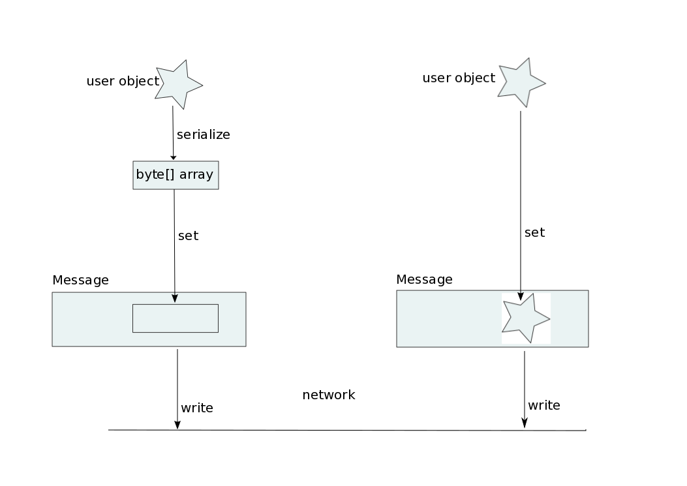

= Status JGroups 2018
:author: Bela Ban belaban@mailbox.org
:backend: deckjs
:deckjs_transition: fade
:navigation:
:deckjs_theme: web-2.0
:goto:
:menu:
:toc:
:status:

= JGroups 4.0.8

* Multiple discovery protocols: https://issues.jboss.org/browse/JGRP-2224
[source.xml]
----
   <TCP ... />
   <TCPPING initial_hosts="127.0.0.1[7800]" port_range="0"/>
   <PING />
   <MPING/>
   <FILE_PING/>
   <MULTI_PING async_discovery="true"/>
   <MERGE3/>
   ...
----
* Will be changed, so that multiple discovery protocols can be configured without the need for `MULTI_PING` to
be present

= JGroups 4.0.10
* `INJECT_VIEW`: protocol to inject random views (https://issues.jboss.org/browse/JGRP-2243)

= JGroups 4.0.12
* `ASYM_ENCRYPT` simplifications / bugfixes:
** https://issues.jboss.org/browse/JGRP-2270
** https://issues.jboss.org/browse/JGRP-2272
** https://issues.jboss.org/browse/JGRP-2273
** https://issues.jboss.org/browse/JGRP-2274
** https://issues.jboss.org/browse/JGRP-2275
* `MERGE3`: a dead merge leader never leads to a merge (https://issues.jboss.org/browse/JGRP-2276)
* `TUNNEL`: bundling is now supported (https://issues.jboss.org/browse/JGRP-2255)
* `RELAY2`: notifications when someone becomes site master, or ceases to be site master
  (https://issues.jboss.org/browse/JGRP-2267)

= JGroups 4.0.13
* `CENTRAL_LOCK2`: new locking protocol that doesn't use a backup lock manager, but reconciliation when the coordinator
  (lock manager) crashes or leaves
** Less communication during regular operation, but chatty during coordinator crash
** https://issues.jboss.org/browse/JGRP-2249
** Design doc: https://github.com/belaban/JGroups/blob/master/doc/design/CENTRAL_LOCK2.txt

* Change the way a coordinator leaves gracefully
** Same code is now used to handle coord crashes and leaves
** Instead of installing the 'last view', a leaving coord asks the next-in-line to do that
** https://issues.jboss.org/browse/JGRP-2277

* Asynchronous `MERGE3`
** Uses `FIND_MBRS_ASYNC` event to asynchronously do discovery
** Callback is called on _every response_
** Fixes https://issues.jboss.org/browse/JGRP-2281

= JGroups 4.0.16
* Fix for JGRP-2277: https://issues.jboss.org/browse/JGRP-2293

= JGroups 5.0

== New buffer management
* https://issues.jboss.org/browse/JGRP-2218
* A `Message` has a `byte[]` array
** This forces users to pass `byte[]` arrays
*** What if someone has an NIO `ByteBuffer`? -> Needs to be converted to a `byte[]` array -> copy!
*** An Object needs to be marshalled into a `byte[]` array: additional copy

* New `Payload` interface replaces `byte[]` array
** Methods to read from a stream, write to a stream etc
* Implementations:
** `ByteArrayPayload`: wraps a `byte[]` array, offset and length (default)
** `NioPayload`: wraps an NIO heap- or direct- buffer
** `ObjectPayload`: wraps an object
** `CompositePayload`: wraps multiple payloads, e.g. metadata and `byte[]` array
*** Example: `UPerf`: currently, metadata and payload has to be copied into a new `byte[]` array
** `PartialPayload`: ref to a payload, with offset and length
*** Example use: fragmentation
** `IntPayload`: wraps an `int`
* Advantages
** More flexible payload management:
*** Install custom payload factories (e.g. possibly with ref-counting)
*** Provide additional implementations, register with factory at runtime
** Late serialization: e.g. an `ObjectPayload` could be serialized directly into a socket's output stream when sent
** Late de-serialization: `ObjectPayload` carries `byte[]` array all the way up, until the object is accessed for the
   first time
** Possible optimizations in combination with gathering writes / scattering reads (NIO.2)

 array versus payload,width="80%",align=left,valign=top]

=== Goals for buffer management
* Sending a message: zero allocation of `byte[]` arrays / `ByteBuffers`
* Receiving a message: _at most_ one allocation
** `ObjectPayload` may even have zero allocation (walk through code)

== Multiple transports
* https://issues.jboss.org/browse/JGRP-1424
* Runs multiple transports in the same stack, e.g. TCP and UDP
* Multiple transports of the same type, e.g. UDP for load balancing purposes

== Infiniband / RDMA support
* https://issues.jboss.org/browse/JGRP-1680
* Requires JNI, probably a showstopper
* Update: JXIO offers Java support of RDMA, shared memory
** https://github.com/accelio/JXIO
* Chronicle?
** Fast message passing between processes on the same host by using shared memory

= Workshop
* Revamped, uses 4.x
* Removed sections, added sections on split brain
* Shortened to 4 days
* https://github.com/belaban/workshop/blob/master/slides/toc.adoc
* Held in Rome (Nov 7-10) and Berlin (Nov 21-24)
