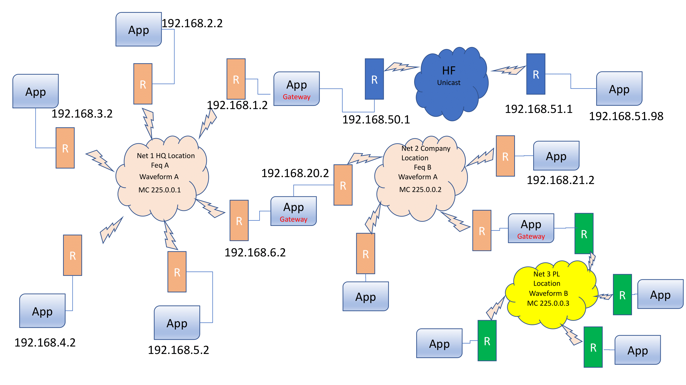

= Status JGroups 2022
:author: Bela Ban belaban@mailbox.org
:backend: deckjs
:deckjs_transition: fade
:navigation:
:deckjs_theme: web-2.0
:goto:
:menu:
:toc:
:status:

== JGroups
* Small library providing *clustering* to Java applications
* Join / leave a cluster
* Get the cluster *view*: list of members (e.g. `{node1,node-2,node-3}`)
* Send messages (byte[] arrays or objects) to *individual* members
* Send messages to *all* members
* Notification when message is received
* Used by Infinispan to send and receive messages (gets and puts) and to rebalance on view changes

== Highlights 5.2.x - 5.5.x
* Routing in asymmetric networks with `RELAY3`
* New reliable retransmission protocols based on fixed buffers: `NAKACK4`, `UNICAST4`
* Support for Keycloak deployments (`JDBC_PING2`)
* Convergence on a single bundler (`PerDestinationBundler`)
* Tons of performance (and bug) fixes
* Configuration changes (simplification, reuse)
* Extensive perftests with IspnPerfTest

== JGroups 5.2.3 - 5.2.29

=== TCP supports TLS
* https://issues.redhat.com/browse/JGRP-2689 (thanks to Tristan)

=== GossipRouter enhancements
* TLS, mainly used by operator

=== PerDestinationBundler
* More on this later

=== io_uring transport
* Used Netty: https://issues.redhat.com/browse/JGRP-2579
* Not really used; performance didn't show great improvements

=== Disable retransmissions
* https://issues.redhat.com/browse/JGRP-2675 and
* https://issues.redhat.com/browse/JGRP-2676

=== Simplified stack when transport is TCP
* Remove flow control, retransmission and fragmentation when transport == `TCP`
* TCP/IP provides for this anyway
* Nice idea, but devil lies in the details
* Showstoppers:
** `RED`, bounded queue in bundler could lead to discarded messages
* TCP connection reaping or concurrent connection establishment, too
* Also: full thread pool (not applicable for vthreads) or processing policy
* TLS also poses problems (handshake on connection establishment)
* Turns out the long tail of issues is too long, and led to complex code to handle all possible
  edge cases
* https://issues.redhat.com/browse/JGRP-2681, fan out from there
* https://issues.redhat.com/browse/JGRP-2566
* https://issues.redhat.com/browse/JGRP-2682

=== Heartbeating on GossipRouter
* Heartbeats are exchanged between a client and a GossipRouter
* Needed when GossipRouter is blocked or hangs
* Useful for cross-site deployments
* https://issues.redhat.com/browse/JGRP-2753

=== New protocol to measure rate
* `RATE`: measures bytes per second, up or down
* https://issues.redhat.com/browse/JGRP-2774

[source]
----
[mac] /Users/bela$ probe RATE.curr,high
#1 (234 bytes):
A [ip=192.168.1.110:7800, 4 mbr(s), cluster=uperf, version=5.5.1.Final-SNAPSHOT (Vorder Höhi) (java 17.0.16+8)]
RATE={current_receive_rate=68.81MB, current_send_rate=69.24MB, highest_receive_rate=70.60MB, highest_send_rate=69.98MB}

#2 (234 bytes):
C [ip=192.168.1.110:7802, 4 mbr(s), cluster=uperf, version=5.5.1.Final-SNAPSHOT (Vorder Höhi) (java 17.0.16+8)]
RATE={current_receive_rate=68.62MB, current_send_rate=68.08MB, highest_receive_rate=71.31MB, highest_send_rate=70.09MB}

#3 (234 bytes):
D [ip=192.168.1.110:7803, 4 mbr(s), cluster=uperf, version=5.5.1.Final-SNAPSHOT (Vorder Höhi) (java 17.0.16+8)]
RATE={current_receive_rate=64.22MB, current_send_rate=65.55MB, highest_receive_rate=69.06MB, highest_send_rate=68.90MB}

#4 (234 bytes):
B [ip=192.168.1.110:7801, 4 mbr(s), cluster=uperf, version=5.5.1.Final-SNAPSHOT (Vorder Höhi) (java 17.0.16+8)]
RATE={current_receive_rate=69.13MB, current_send_rate=68.76MB, highest_receive_rate=71.50MB, highest_send_rate=70.80MB}

4 responses (4 matches, 0 non matches)

----

=== Bundlers drop message if queue is full
* Removes one more point where sending can block
* https://issues.redhat.com/browse/JGRP-2793

== JGroups 5.3.0 - 5.3.22

=== Routing in asymmetric networks: RELAY3
* `RELAY2`: if M is sent from site A to site B, but the site master of B (or A!) crashes, even if a new site
  master steps in, M is lost and won't get retransmitted.
* `RELAY3` adds reliability across sites: M will get retransmitted when the new site master of A (or B) comes up
** This applies only to *unicast* messages
* Not all sites are connected to each other: to send a message to a site Y, it might have to get sent
  via (gateway) site X
* Example:

.Asymmetric routing with RELAY3

* Topology: `hf` - `net1` - `net2` - `net3`
* To send a message from `net3` to `hf`, it has to be forwarded from `net3` -> `net2` -> `net1` -> `hf`
* Configuration:

* Demo
* https://issues.redhat.com/browse/JGRP-1506

=== Async sending
* When receiving a message (request to Infinispan), oftentimes the receiver sends another
message while processing the request (e.g. JGroups sends credits). This delays the request
processing, and it would be better if the send was asynchronous
* Need to investigate better, as the send is usually very fast
* https://issues.redhat.com/browse/JGRP-2603

=== JDBC_PING2
* Improvements over `JDBC_PING` (not really maintained)
* (More) legible representation in DB table:

[source]
------------------------
         address       | name | cluster |         ip         | coord
-----------------------+------+---------+--------------------+-------
 uuid://eb4c91b5-238c- | A    | chat    | 192.168.1.110:7800 | t
 uuid://a023a43b-c68c- | B    | chat    | 192.168.1.110:7801 | f
(2 rows)
------------------------
* Requirement by Keycloak
* https://issues.redhat.com/browse/JGRP-2795

=== Metrics
* Code to expose numerical attributes and properties to Micrometer
* https://issues.redhat.com/browse/JGRP-2796

=== Time units in attributes
* E.g. `max_time="30s"`, `xmit_interval="300ms"`
* https://issues.redhat.com/browse/JGRP-2811

=== Show round trip times between members
* Can be invoked either programmatically or via probe, e.g.

[source]
----
[mac] /Users/bela/JGroups$ probe UDP.rtt.rtt[1000,true,false]
#1 (189 bytes):
C [ip=192.168.1.110:7802, 3 mbr(s), cluster=chat, version=5.4.0.Final (Alpe d'Huez) (java 21+35-2513)]
RTT.rtt:
B: 778us/851us/970us
C: 22us/75.10us/163us
A: 935us/995.20us/1.02ms

#2 (192 bytes):
A [ip=192.168.1.110:7800, 3 mbr(s), cluster=chat, version=5.4.0.Final (Alpe d'Huez) (java 21+35-2513)]
RTT.rtt:
B: 841us/884.40us/956us
C: 861us/894.40us/916us
A: 88us/131.30us/226us

#3 (193 bytes):
B [ip=192.168.1.110:7801, 3 mbr(s), cluster=chat, version=5.4.0.Final (Alpe d'Huez) (java 21+35-2513)]
RTT.rtt:
B: 81us/107.60us/245us
C: 939us/955.10us/1.00ms
A: 1.01ms/1.02ms/1.03ms

3 responses (3 matches, 0 non matches)
----
* https://issues.redhat.com/browse/JGRP-2812

=== GossipRouter certificate reloading
* https://issues.redhat.com/browse/JGRP-2813

=== TCPPING: configure via file
* `initial_hosts_file=hosts.txt`
* Useful in cloud environments; CLIs can usually generate this file
* Format: `host1,host2[7800],host3[7800]`
* Used by IspnPerfTest to run tests on AWS, GCP
* https://issues.redhat.com/browse/JGRP-2859

== JGroups 5.4.0 - 5.4.12

=== NAKACK4
* Concepts (`NAKACK2`)
** A sender keeps message M in a retransmission buffer, until it knows that all members have received M
** Missing messages are retransmitted
** `STABLE` periodically (or after N bytes) asks all members for their highest received messages and
   sends a stable digest with the highest messages seen by all
** Every sender then removes messages seen by *all members*
** The retransmission buffer is unbounded, can grow and shrink (compaction)
** To keep the buffer within limits, flow control protocols (`MFC`) make sure a sender can only send a
   max number of messages until it needs to wait for acks
* `NAKACK4`
** Has a fixed retransmission (ring) buffer
** Senders block when there is no space
** Receivers add messages and deliver them to the application
** Receivers send ACKs back to senders
** When a sender has received ACKs from all receivers for a given message M, it purges M from
   the retransmission buffer, possibly unblocking senders
* Advantages
** Faster stability, built-in flow control
** No need for `STABLE`, `MFC` -> smaller configuration
** Less memory churn / pressure
** Better performance
* https://issues.redhat.com/browse/JGRP-2780
* Manual: http://www.jgroups.org/manual5/index.html#NAKACK4

=== UNICAST4
* Same as `UNICAST3`, but using fixed retransmission buffers
* Flow control protocol `UFC` can be removed
* https://issues.redhat.com/browse/JGRP-2843
* Manual: http://www.jgroups.org/manual5/index.html#UNICAST4
* Example of new config:

[source,xml]
----
<config>
    <include file="${transport-config:tcp-default.xml}" />
    <TCPPING initial_hosts="${jgroups.tcpping.initial_hosts:localhost[7800]}"/>
    <MERGE3 />
    <FD_SOCK2/>
    <FD_ALL3 timeout="40s" interval="5s" />
    <VERIFY_SUSPECT2 timeout="1.5s"  />
    <NAKACK4 use_mcast_xmit="false" capacity="8192" />
    <UNICAST4 />
    <pbcast.GMS print_local_addr="true" join_timeout="1s"/>
    <FRAG2 frag_size="60K"  />
</config>
----

NOTE: Protocols `STABLE`, `MFC` and `UFC` are not needed anymore: 10 protocols instead of 13

=== Bundle loopback messages
* Messages sent to self, or multicast messages, were not bundled, but sent one by one
* Performance increase with bundling, especially for smaller messages: 17% (`MPerf`)
* May not be of value to Infinispan, as it doesn't use a lot of multicasts and doesn't
  send unicasts to self (correct?)
* https://issues.redhat.com/browse/JGRP-2831

=== Removed pinned threads
* When using virtual threads (JEP 491)
* Replaced `synchronized` with locks
* https://issues.redhat.com/browse/JGRP-2861 and others

== JGroups 5.5.0 - 5.5.1 (current)

=== New MPSC queues
* Optimized for a single consumer, but multiple producers
* Replacement for `ArrayBlockingQueue`
* Non-blocking, except when waiting on empty/full
* Blocking on empty/full can be configured
* Used by bundlers
** Producers add to queue, drop if full
** Consumer uses efficient (lockless) `drainTo()` to get all messages and sends them
* `ConcurrentBlockingLinkedQueue`: https://issues.redhat.com/browse/JGRP-2890
* `ConcurrentBlockingRingBuffer`: https://issues.redhat.com/browse/JGRP-2900
* Increased performance (see IspnPerfTest below)

=== New default bundler
* Ends the bundler wars (issue below is 10 years old!)
* New default: `PerDestinationBundler`
* `TransferQueueBundler` still available, as fallback (20 years old)
* `NoBundler` also still available
* 7 bundlers removed
* https://issues.redhat.com/browse/JGRP-1997

=== PerDestinationBundler
* New bundler which uses *one queue per destination* (`null` is a seperate destination)
* If `use_single_sender_thread=false`: 1 thread / queue, handling sending of messages
* If `true`: a single thread handles all queues
* `PerDestinationBundler` has less contention between producers and consumer than
  `TransferQueueBundler` which uses a single queue for all messages
* https://issues.redhat.com/browse/JGRP-2896
* Performance
** UPerf, 4 local nodes, tcp.xml
|===
| Bundler | requests/sec/node

| TQB | 196'261
| PDB -use_single_sender_thread | 202'360
| PDB +use_single_sender_thread | *216'048*
|===
** IspnPerfTest
|===
| Bundler | requests/sec/node

| TQB |  154'372
| PDB -use_single_sender_thread | 127'387
| PDB +use_single_sender_thread | *160'538*
|===

=== Inclusion in configuration
* Stolen from Infinispan (thanks Tristan)
* Define a transport only once and include it in other configurations, e.g.

[source,xml]
----
<config>
    <include file="${transport-config:/Users/bela/tcp-default.xml}"
             bundler.use_single_sender_thread="false"
             sock_conn_timeout="${conn-timeout:500}" />
    <MPING/>
    ...
</config>
----
* `tcp-default.xml` defines the default transport
** By setting `-Dtransport-config=udp-default.xml`, the transport can be chosen at startup time
* Allows for overrides of attributes, e.g. `sock_conn_timeout`
** This can also be overridden at startup time (makes no sense though...)
* Multiple includes are possible, e.g. transport and discovery protocols
* Cannot add or remove protocols
* https://issues.redhat.com/browse/JGRP-2908

=== New protocols to show messages sizes
* `SIZE`: https://issues.redhat.com/browse/JGRP-2893
[source]
----
[mac] /Users/bela/JGroups$ probe SIZE.dumpUpSamples[]
#1 (423 bytes):
mac-54345(v=16.0.0) [ip=192.168.1.110:7803, 4 mbr(s), cluster=default, version=5.4.9.Final (Alpe d'Huez) (java 24+36-3646)]
SIZE.dumpUpSamples=

...

#4 (424 bytes):
mac-33618(v=16.0.0) [ip=192.168.1.110:7800, 4 mbr(s), cluster=default, version=5.4.9.Final (Alpe d'Huez) (java 24+36-3646)]
SIZE.dumpUpSamples=
1: 1’110’328
29: 284’516
30: 550’647
31: 265’804
37: 1’909
38: 222’453
39: 1’379’171
40: 1’202’811
1’026: 2’795’048
1’126: 225
1’127: 27’686
1’128: 243’269
1’129: 695’328
1’130: 919’844
1’131: 591’099
1’132: 150’904

4 responses (4 matches, 0 non matches)
----
* The above example is from IspnPerfTest: interesting to see how sizes increase...
* `SIZE2`: https://issues.redhat.com/browse/JGRP-2895
* Samples size distribution into buckets:

[source]
----
[mac] /Users/bela$ probe SIZE2.dumpUpSamples[]
#1 (285 bytes):
mac-1580(v=16.0.0) [ip=192.168.1.110:7803, 4 mbr(s), cluster=default, version=5.4.9.Final-SNAPSHOT (Alpe d'Huez) (java 24+36-3646)]
SIZE2.dumpUpSamples=[0 .. 100]: 4’662’222
[101 .. 1’000]: 6
[1’001 .. 1’500]: 4’957’605
[1’501 .. 2’000]: 6
[2’001 .. 100’000]: 4

#2 (287 bytes):
mac-56987(v=16.0.0) [ip=192.168.1.110:7802, 4 mbr(s), cluster=default, version=5.4.9.Final-SNAPSHOT (Alpe d'Huez) (java 24+36-3646)]
SIZE2.dumpUpSamples=[0 .. 100]: 4’634’174
[101 .. 1’000]: 5
[1’001 .. 1’500]: 4’867’320
[1’501 .. 2’000]: 11
[2’001 .. 100’000]: 7

#3 (287 bytes):
mac-8833(v=16.0.0) [ip=192.168.1.110:7801, 4 mbr(s), cluster=default, version=5.4.9.Final-SNAPSHOT (Alpe d'Huez) (java 24+36-3646)]
SIZE2.dumpUpSamples=[0 .. 100]: 4’523’464
[101 .. 1’000]: 6
[1’001 .. 1’500]: 4’807’314
[1’501 .. 2’000]: 12
[2’001 .. 100’000]: 12

#4 (286 bytes):
mac-24327(v=16.0.0) [ip=192.168.1.110:7800, 4 mbr(s), cluster=default, version=5.4.9.Final-SNAPSHOT (Alpe d'Huez) (java 24+36-3646)]
SIZE2.dumpUpSamples=[0 .. 100]: 4’613’013
[101 .. 1’000]: 2
[1’001 .. 1’500]: 4’778’180
[1’501 .. 2’000]: 0
[2’001 .. 100’000]: 0

4 responses (4 matches, 0 non matches)
----
* Same test as before

=== Move Java baseline from 11 -> 17

=== Removed non blocking flow control protocols
* https://issues.redhat.com/browse/JGRP-2925

== Current (5.5.1)

=== Reference counting
* Used with Netty's `ByteBuf` pools
* This is the *second* time this has been added (and probably removed) :-)
* https://issues.redhat.com/browse/JGRP-2942
* Undo: https://issues.redhat.com/browse/JGRP-2948

=== MessageFactory: allow to configure in transport
* Possibly necessary by `InfinispanMessage`
* Hack
* https://issues.redhat.com/browse/JGRP-2944

== Misc

=== IspnPerfTest
* Used to test Infinispan on AWS, GCP
* Added batch mode, ansible support (thanks Jose) to automate runs
* 8 nodes on AWS / GCP, JDKs: 21, 24, 25, Infinispan 15.0.18,15.2.5/16.dev03, JG 5.5.0
* Results: https://issues.redhat.com/browse/JGRP-2907

=== Virtual threads as default
* Starting with Java 21 as baseline
* Optimizations and removal of classes (thread pool) when vthreads are used everywhere

=== Nexus3 migration woes
* Tempted to use Nexus Central directly

== Outlook / todos
* IspnPerfTest with `5.5.1`, comparing existing versus new protocols
* TBD: use new protocols in Infinispan
* TBD: use `RELAY3` in Infinispan
