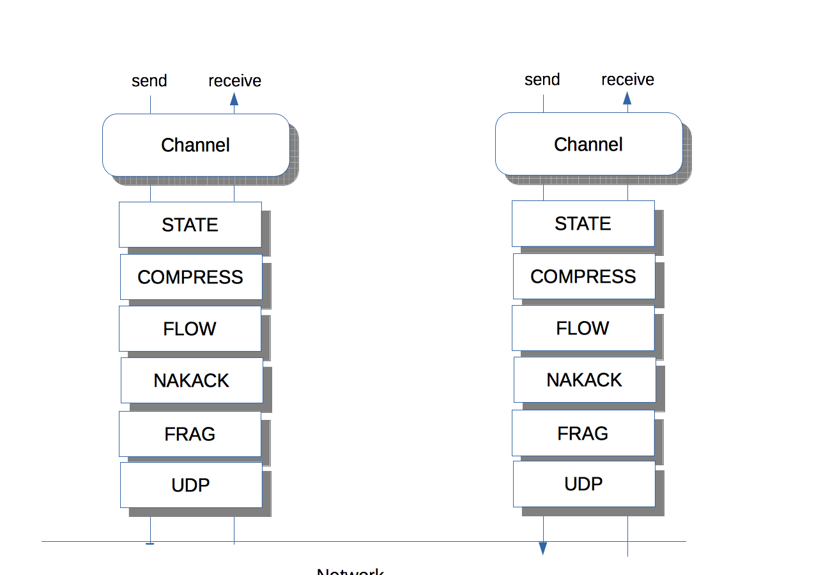
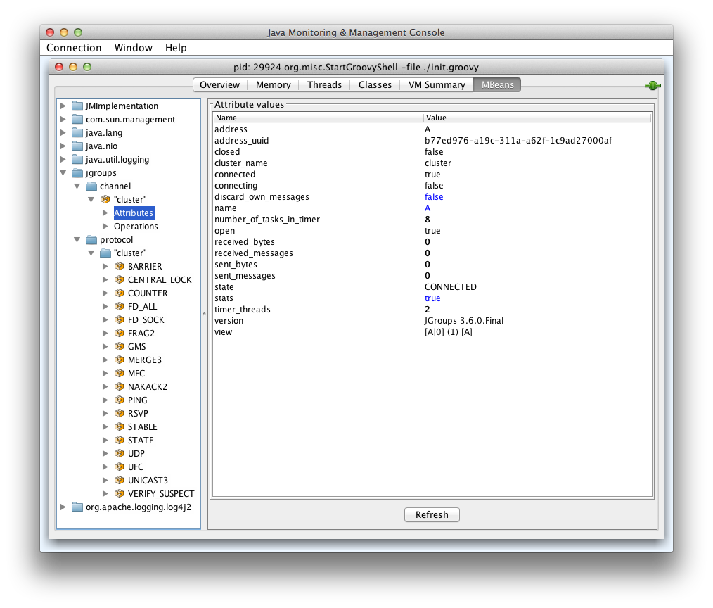

Using JGroups: overview and API
===============================
:author: Bela Ban belaban@yahoo.com
:backend: deckjs
:deckjs_transition: fade
:navigation:
:deckjs_theme: web-2.0
:deckjs_transition: fade
:goto:
:menu:
:toc:
:status:

What is it ?
------------
* Clustering library (only *a single 2MB JAR*) to write clustered applications
** Communication in a cluster
** Chat
** Replicated or distributed state (session state in application servers)
** Task distribution
** Presence
** Pub/sub
* Processes (nodes) on different hosts form a cluster and send each other messages
** Reliable _one-to-many_ or _one-to-one_ communication
* Nodes get notifications when others join or leave (or crash)
* Runs on Android, too

Goals for JGroups
-----------------
* Keep JGroups small, lean & mean and don't lose focus of the scope (reliable group comm)
* I'm happier if I can remove something than if I have to add something
* "A designer knows he has achieved perfection not when there is nothing left to add, but when there is nothing left
   to take away" (Antoine de Saint-Exupery)
* I like KISS
* I'm fighting dependency orgies seen in a lot of projects today
* JGroups has 0 (runtime) dependencies and I want to keep it that way

JGroups has 3 parts
-------------------
. JChannel
* A _cluster node endpoint_. Like a socket

. Protocol stack
* Users can add, remove, replace, enhance, or even write their own protocols
* Ships protocols for
** Network communication (transport)
** Membership discovery
** Failure detection
** Lossless and ordered transmission
** Network split handling and subsequent merging
** Notification when nodes join or leave the cluster (membership)
** Flow control
** Fragmentation
** Compression, encryption, authentication
* Stack can be adapted to every environment

. Building blocks
* Used over a channel
** Method invocation across a cluster
** Distributed caches, counters, locks, task execution

Architecture
------------
* Users deal mainly with the _channel_ (`JChannel`)
* The protocol stack is setup according to an XML config file
* A sent message passes the stack _top-down_
* A received message is passed up through the stack _bottom-up_

Common classes
--------------
* `Address`
** Identifies a node (=member) in a cluster
** Can be used as destination to send a message to a node
** A node's address can be retrieved from the channel: `JChannel.getAddress()`

* `View`
** List of addresses, lists all cluster nodes
** Order is the same in all nodes
** Example: `A[4] (2) [A, B]`
*** View was created by (coordinator) A and the current cluster contains A and B

* `Message`
** This is sent and received by cluster nodes
** Destination and sender's addresses
*** Destination == null: send to entire cluster
** Payload (`byte[]` buffer)
** Flags
** Headers (used mainly by protocols to add information, e.g. sequence numbers)
* Example:

[source,java]
----
// "hello" is serialized into a byte[] buffer
Message msg=new Message(null, "hello")
                .setFlag(Message.Flag.OOB); // set flag OOB
channel.send(msg);
----

Receiving messages
------------------
* The _push model_ is used
* Callbacks are used to receive messages and view changes
* Users typically extend `ReceiverAdapter` and override `receive()` and `viewAccepted()`:

[source,java]
----
public void receive(Message msg) {
    Address sender=msg.getSrc();
    String greeting=(String)msg.getObject();
    System.out.println("received " + greeting + " from " + sender);
}

public void viewAccepted(View view) {
    System.out.println("received view " + view);
}
----

JChannel
--------
* A `JChannel` is used to represent a cluster node
* Simple API: create, connect, send / receive, disconnect, destroy
* Example:

[source,java]
----
// Create a channel, name it "A":
JChannel ch=new JChannel("/home/bela/udp.xml").name("A");

// Add a receiver to receive messages:
ch.setReceiver(msg ->
        System.out.printf("msg from %s: %s\n", msg.src(), msg.getObject()));

// Join the cluster "demo-cluster":
ch.connect("demo-cluster");

// Send a message to all nodes (including myself):
Message msg=new Message(null, "hello world");
ch.send(msg);

// Disconnect and close the channel:
ch.close();
----

Creation of a channel
---------------------
* There are a number of constructors available:

[source,java]
----
public JChannel(); // creates a default channel (uses udp.xml)
public JChannel(File properties); // from a file
public JChannel(Element el); // from a DOM element
public JChannel(URL url); // from a URL
public JChannel(String props); // config file on the classpath
public JChannel(InputStream input); // input stream
public JChannel(Protocol ... protocols); // programmatic creation
public JChannel(Collection<Protocol> protocols);
public JChannel(JChannel ch); // from another channel
----

Sample XML configuration file
-----------------------------
* _Bottom-up_: `UDP` is the transport protocol, `FRAG2` is the top protocol
* Attributes configure the protocols, e.g. `mcast_port` in `UDP`
* Attributes can use variables, e.g. `${jgroups.udp.mcast_port:45588}`
** System property `-Djgroups.udp.mcast_port=60000` overrides the (default) value of `45588`

[source,xml]
----
<config xmlns="urn:org:jgroups"
        xmlns:xsi="http://www.w3.org/2001/XMLSchema-instance"
        xsi:schemaLocation="urn:org:jgroups http://www.jgroups.org/schema/jgroups.xsd">
    <UDP mcast_port="${jgroups.udp.mcast_port:45588}" />
    <PING />
    <MERGE3 max_interval="30000"
            min_interval="10000"/>
    <FD_SOCK/>
    <FD_ALL/>
    <VERIFY_SUSPECT timeout="1500"  />
    <pbcast.NAKACK2 xmit_interval="500"
                    use_mcast_xmit="false"/>
    <UNICAST3 xmit_interval="500"
              conn_expiry_timeout="0" />
    <pbcast.STABLE desired_avg_gossip="50000"
                   max_bytes="4M"/>
    <pbcast.GMS print_local_addr="true" join_timeout="2000"
                view_bundling="true"/>
    <UFC max_credits="2M" min_threshold="0.4"/>
    <MFC max_credits="2M" min_threshold="0.4"/>
    <FRAG2 frag_size="60K"  />
</config>
----

Programmatic creation
---------------------
* A channel can also be created without any XML config file, ie. programmatically:

[source,java]
----
Protocol[] prot_stack={
          new UDP().setValue("bind_addr", InetAddress.getByName("127.0.0.1")),
          new PING(),
          new MERGE3(),
          new FD_SOCK(),
          new FD_ALL(),
          new VERIFY_SUSPECT(),
          new BARRIER(),
          new NAKACK2(),
          new UNICAST3(),
          new STABLE(),
          new GMS(),
          new UFC(),
          new MFC(),
          new FRAG2()}; // <1>
JChannel ch=new JChannel(prot_stack) // <2>
            .name("A"); // <3>
----
<1> First, an array of protocols is created.
<2> Next, the `JChannel` constructor which accepts the protocols array is called
<3> Finally, the channel is given a logical name ("A")

Time for some interactivity !
-----------------------------
* Start a Groovy shell:
** `cd workshop/bin`
** Modify `run.sh` or `run.bat`: set `BIND_ADDR` to the IP of the network interface to be used)
** `./groovy-shell.sh` (or `groovy-shell.bat`)
* Create a channel:
----
  groovy:000> ch=new JChannel("config.xml").name("A");
  ===> org.jgroups.JChannel@609640d5
----
* Alternative (uses `init.groovy`):
----
groovy:000> ch=createChannel("A");
===> org.jgroups.JChannel@44a2b17b
----

Joining a cluster
-----------------
* When a client wants to join a cluster, it _connects_ to a channel giving the name of the cluster to be joined:

[source,java]
----
public Channel connect(String cluster_name) throws Exception;
----
* `cluster_name` is the name of the cluster to be joined
** All channels that call `connect()` with the same name form a cluster
* Messages sent on any channel in the cluster will be received by all members (including the one who sent it)
** Local delivery can be turned off using `setDiscardOwnMessages(true)`.          
* The `connect()` method returns as soon as the new member has joined successfully
* If there are no other members, then a new cluster is created and the member joins it as first member. 
** The first member of a cluster becomes its _coordinator_.
** A coordinator is in charge of installing new views whenever the membership changes
* A node can join only one cluster at a time
----
  groovy:000> ch.connect("demo");
----

Utility methods of JChannel
---------------------------
* Getting the address of a node: `getAddress()`
* Getting the name of the cluster which a node joined: `getClusterName()`
* Getting the current view of a node: `getView()`
* Getting the logical name of a node: `getName()`
* Misc: `isOpen()`, `isConnected()`, `isClosed()`
* Use tab-completion of groovy-shell to find more methods

Registering a channel with JMX
------------------------------
* A channel can expose its operations and attributes via JMX:

[source,java]
----
JChannel ch=...
ch.connect("cluster");
Util.registerChannel((JChannel)ch, "jgroups");
----

* Attributes and operations can be accessed with a JMX client, e.g. `jconsole`:

Receiving messages
------------------
* Method `receive()` in ReceiverAdapter (or Receiver) can be overridden to receive messages:

[source,java]
----
public void receive(Message msg);
----

* A Receiver can be registered with a channel using `JChannel.setReceiver()`. All received messages
will invoke callbacks on the registered receiver:

[source,java]
----
JChannel ch=new JChannel();
ch.setReceiver(new ReceiverAdapter() {
    public void receive(Message msg) {
        System.out.println("received message " + msg);
    }
    public void viewAccepted(View v) {
        System.out.println("received view " + v);
    }
});
ch.connect("MyCluster");
----

----
  groovy:000> ch.setReceiver(new SampleReceiver());
----

Receiving view changes
----------------------
* As shown above, the `viewAccepted()` callback of ReceiverAdapter can be used
to get notified when a cluster membership change occurs. The receiver needs to be set via
`JChannel.setReceiver()`.

NOTE:
Code in callbacks must avoid anything that takes a lot of time, or blocks; JGroups
invokes this callback as part of the view installation, and if this user code blocks,
the view installation would block, too.

Sending messages
----------------
* JChannel has a number of `send()` methods:

[source,java]
----
public Channel send(Message msg) throws Exception; // <1>
public Channel send(Address dst, Serializable obj) throws Exception; // <2>
public Channel send(Address dst, byte[] buf) throws Exception; // <3>
public Channel send(Address dst, byte[] buf, int off, int len) throws Exception; // <4>
----
<1> Accepts a message as parameter. The message's destination should either be the address of the
receiver (unicast) or null (multicast). When the destination is null, the message will be sent to all members
of the cluster (including itself). 
<2> The object will be serialized into a `byte[]` buffer and set as the message's payload.
<3> The payload is defined directly
<4> Same as above, but allows for definition of length and offset of the payload into a buffer

----
  groovy:000> ch.send(null, "hello world");
----

A note about buffer reuse
-------------------------
* Typical (incorrect) code:

[source,java]
----
protected void sendFile() throws Exception {
    FileInputStream in=new FileInputStream(filename);
    byte[] buf=new byte[8096];
    for(;;) {
        int bytes=in.read(buf);
        if(bytes == -1)
            break;
        channel.send(new Message(null, buf, 0, bytes));
    }
}
----
* Buffer `buf` is reused and can get overwritten with new data while JGroups
** queues the message in a bundler and sends multiple messages as a message batch
** possibly retransmits the message if not received by the receiver(s); retransmitting the changed buffer
* Correct: move `buf` into the for loop

Getting the group's state
-------------------------
* Frequently clusters have _shared state_, ie. every node has the same local state, and updates are propagated
across the cluster to all nodes, which then update their local state
* State can be anything, e.g. a hashmap that stores servlet session data
* A newly joined member may want to retrieve the state of the cluster before starting work. This is done
with `getState()`:

[source,java]
----
public Channel getState(Address target, long timeout) throws Exception;
----

* This method requests the state from the coordinator (target == null)
** If a timeout (ms) elapses before the state has been fully fetched, an exception will be thrown
** A timeout of 0 waits until the entire state has been transferred.
* To participate in state transfer, both state provider and state requester have to override the
following methods in `ReceiverAdapter`:

[source,java]
----
public void getState(OutputStream output) throws Exception;
public void setState(InputStream input) throws Exception;
----

* Method `getState()` is invoked on the _state provider_ (usually the coordinator)
** It needs to write its state to the output stream given.
* The `setState()` method is invoked on the __state requester__; this is the member
which called `JChannel.getState()`
** It needs to read its state from the input stream and set its
internal state to it.
            

State transfer sequence diagram
-------------------------------
* In a cluster consisting of A, B and C, with D joining the cluster and calling `Channel.getState()`, the
following sequence of callbacks happens:               
** D calls `JChannel.getState()`. The state will be retrieved from the oldest member, A
** A's `getState()` callback is called. A writes its state to the output stream passed as a
  parameter to `getState()`.
** D's `setState()` callback is called with an input stream as argument. D reads the state from the
  input stream and sets its internal state to it, overriding any previous data.
** D: `JChannel.getState()` returns
                    

State transfer sample code
--------------------------
* The following code fragment shows how a group member participates in state transfers:

[source,java]
----
public void getState(OutputStream output) throws Exception {
    synchronized(state) {
        Util.objectToStream(state, new DataOutputStream(output));
    }
}

public void setState(InputStream input) throws Exception {
    List<String> list=(List<String>)Util.objectFromStream(new DataInputStream(input));
    synchronized(state) {
        state.clear();
        state.addAll(list);
    }
    System.out.println(list.size() + " messages in chat history):");
    for(String str: list)
        System.out.println(str);
}
----

* This code is the Chat example from the JGroups tutorial and the state here is a list of strings.
* The `getState()` implementation synchronizes on the state (so no incoming messages can modify it during
the state transfer), and uses the JGroups utility method `objectToStream()`.
* The `setState()` implementation also uses the `Util.objectFromStream()` utility method to read the state from
the input stream and assign it to its internal list.
            

State transfer protocols
------------------------
* In order to use state transfer, a state transfer protocol has to be included in the configuration.
This can either be `STATE_TRANSFER`, `STATE`, or `STATE_SOCK`.

Leaving a cluster
-----------------
* Leaving a cluster is done using the `disconnect()` method:

[source,java]
----
public Channel disconnect();
----

* It will have no effect if the channel is already in the disconnected or closed state
* If connected, it will leave the cluster
** This is done by sending a leave request to the current coordinator
** The coordinator removes the leaving node from the view and installs a new view in all remaining members
* After a successful disconnect, the channel will be in the unconnected state, and may subsequently be
reconnected.

----
  groovy:000> ch.disconnect();
----
            

Destroying a channel
--------------------
* To destroy a channel instance (destroy the associated protocol stack, and release all resources),
method `close()` is used:

[source,java]
----
public void close();
----

* Closing a connected channel disconnects the channel first
* The `close()` method moves the channel to the closed state, in which no further operations are allowed
 (most throw an exception when invoked on a closed channel)
* In this state, a channel is not considered used any longer by an application and -- when the reference to the instance is reset --
 the channel essentially only lingers around until it gets garbage collected

----
  groovy:000> ch.close();
----
            

Lab ChatDemo: writing a simple chat application
-----------------------------------------------
. Create a channel
. Register a ReceiverAdapter with it
.. Method `receive()` prints the received chat message
.. Method `viewAccepted()` prints the view
. Connect the channel
. In a loop
.. Read a line from stdin (`Util.readLine(System.in)`) and
.. Send a message to all cluster nodes
. Extra credits
.. Store the last N messages in memory as state and perform a state transfer on startup
.. Expose contents and length of state via JMX
.. Make N configurable via a property "max_history"

Lab SimpleFileTransfer: transfer small or large files to everyone in the cluster
--------------------------------------------------------------------------------
* Look at the lab
** Yes, we don't know about headers yet, but assume they're just something added to a message
* Can't we use JGroups' fragmentation/defragmentation to send a large message?
* Change the lab to send 1 big message (300MB or so) instead of chunks
** Make sure you point your bind address to localhost (127.0.0.1), or else you'll overwhelm the wifi...
* What changes?
* How many fragments do we generate?

